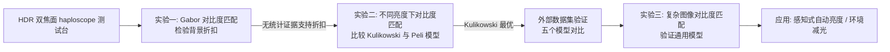

## 一句话总结

光学透视 AR 显示中环境光会叠加进画面、大幅降低物理对比度，但画面看起来却比物理对比度预示的更清晰；本文通过三组心理物理实验证明这一"清晰感"并非来自背景折扣（scission），而是可以用阈上对比度感知模型（尤其 Kulikowski 的加性模型）解释，并据此提出可预测复杂图像可见度的通用对比度匹配模型与感知式自动亮度算法。

## 研究背景

光学透视 AR 显示器把显示光与环境光以叠加方式混合，导致内容的物理对比度被严重压缩，常常比传统显示器低几个数量级。

- 已有的环境减光方案（主动遮光层、墨镜式静态滤光片）虽有效，但增加设计复杂度、降低灵活性；靠强光引擎硬扛又会大幅抬高功耗，对可穿戴设备不友好。
- 一个反直觉的现象是：尽管物理对比度大幅下降，AR 画面看上去仍比预期更锐利、细节更多。
- 已有关于亮度匹配和色度匹配的研究提出一种假说——当用户聚焦于虚拟内容时，视觉系统可能对环境背景做"感知折扣"（scission），即把前景 AR 图像与背景环境分离，从而偏向前景。
- 作者要检验的问题是：AR 中增强的对比感知，究竟来自背景折扣，还是来自"阈上对比度感知随亮度升高而增强"这一更基础的视觉特性。

## 方法

整体框架：先用一台高动态范围、双焦面的单眼镜（haploscope）测试台，在受控条件下做对比度匹配心理物理实验；实验一检验"背景折扣"假说，实验二检验"阈上对比度感知"假说并比较候选模型，实验三把最优模型推广到复杂图像并验证；最后落地到自动亮度应用。

关键设计：

- **HDR 双焦面测试台模拟 AR**：为避开商用 AR 头显中波导、衍射合像器等光学伪影的干扰，自建单眼镜。前景面（$$0.48\,\mathrm{m}$$，$$2.1\,\mathrm{D}$$）经分光镜浮空充当 AR 叠加层，背景面（$$0.71\,\mathrm{m}$$，$$1.4\,\mathrm{D}$$）模拟真实环境，二者约 $$0.7\,\mathrm{D}$$ 屈光差。每个显示面用无背光 4K LCD 叠加 DLP 投影仪照明的扩散屏合成 HDR 图像。观察者用旋钮把单面测试图对比度匹配到双面参考图。
- **两个竞争假说的数学表达**：物理对比度损失记为 $$c_{AR}/c_{base} = Y_{FG}/(Y_{FG}+Y_{BG})$$。背景折扣假说引入折扣系数 $$\gamma=\beta/\alpha$$，使 $$c_{AR}=\lvert Y_{FG}/(Y_{FG}+\gamma Y_{BG})\rvert\, c_{base}$$，检验即检验 $$\gamma\neq 1$$。阈上假说给出两个模型：Kulikowski 加性模型 $$c_{test}-t(Y_{test}) = c_{ref}-t(Y_{ref})$$ 与 Peli 乘性模型 $$c_{test}/t(Y_{test}) = c_{ref}/t(Y_{ref})$$，其中 $$t(Y)$$ 为亮度 $$Y$$ 下的对比度检测阈值，用 castleCSF 预测。
- **散焦模糊的个体化标定**：直接用瞳孔模型预测的散焦模糊比观察者实际感知更强，导致无法匹配；作者为每位观察者单独做散焦模糊匹配实验、取中位数用于主实验刺激生成，确保测试图与双面参考图在光学上仅差亮度。
- **面向复杂图像的全局对比度匹配模型**：定义与内容无关的"等效对比度" $$C'(Y,Y_{BG};c,f)=\max\!\lvert c\,Y/(Y+Y_{BG})-t(Y+Y_{BG},f),\,0\rvert$$，通过在对数域最小化两显示器等效对比度的 L1 距离来匹配感知对比度；对比度按 $$p(c)\propto 1/c$$、空间频率按自然图像 $$1/f^{1+\alpha}$$ 功率谱做逆变换采样，从而可离线预计算、几乎零成本使用。

## 实验结果

实验二在模拟 AR 显示上测量消色差（Ach）与两个 DKL 色向（红绿 RG、黄紫 YV）的对比度匹配数据，用约化卡方统计量（值越小越好，零可调参数假设）比较三个模型的拟合优度：

| 模型 | 消色差 (Ach) | 红绿 (RG) | 黄紫 (YV) |
|---|---|---|---|
| 物理对比度 — Eq. (3) | 2.45 | 1.56 | 1.28 |
| Peli 乘性模型 — Eq. (7) | 3.01 | 1.15 | 1.63 |
| Kulikowski 加性模型 — Eq. (6) | **1.00** | **0.351** | **0.81** |

Kulikowski 加性模型在三个颜色方向上都拟合最好，尤其对"暗 AR 显示 + 高背景光"这类阈值影响最强的条件优势最明显。实验一中除去除散焦模糊的 dual-noise-pinhole 条件（$$p<0.001$$，效应量大于 1，说明散焦模糊必须被正确模拟）外，其余条件均无统计证据支持背景折扣（$$p>0.05$$、效应量小），即对比度感知层面不存在折扣效应。在另外五个外部数据集上的联合拟合中，无可调参数的 Kulikowski 模型总体误差（log cone contrast 的 RMSE，全数据集 $$4.20\,\mathrm{dB}$$）仍优于带参数的 Foley-Legge、Georgeson、Ashraf-Mantiuk 等模型。实验三把模型用于复杂图像的亮度（曝光）匹配，预测与实测峰值亮度的对数域 RMSE 为 $$0.142$$。

## 亮点与局限

亮点：

- 用严谨的心理物理实验直接检验并否定了"背景折扣影响对比度感知"这一流行假说，转而给出更基础的解释：阈上对比度感知随亮度升高而增强。
- 找到一个无可调参数、仅依赖检测阈值的 Kulikowski 加性模型即可在自采数据与五个外部数据集上取得最佳/接近最佳拟合，简洁且可迁移。
- 提出与内容无关、可预计算的全局对比度匹配模型，并落地为感知式自动亮度（Perceptual AB）与环境减光策略，兼顾画质与功耗。

局限（作者自述）：

- 未研究更高层现象，如色貌、环境光对深度感知的影响。
- 未考虑时间性明/暗适应与局部适应对对比度感知的影响。
- 面向复杂图像的模型刻意设计为与内容无关，若纳入内容信息精度可更高，但需大规模数据采集。

## 延伸思考

- 结论适用于任何受叠加环境光影响的显示系统（投影、受反射影响的自发光屏），把"物理对比度 + 阈上感知模型"打通，为色调映射、跨亮度维持画面外观、跨亮度伪影可见度等问题提供统一视角。
- "无可调参数模型胜过带参数模型"是很强的信号，说明对比度匹配现象的本质可能就由 CSF/检测阈值决定，后续可探索把 castleCSF 这类阈值模型直接嵌入 AR 渲染管线。
- 感知式自动亮度提供了"在给定功耗预算下维持等效感知对比度"的可解释曲线，比现有经验式自动亮度更贴合人眼特性，对可穿戴 AR 的续航-画质权衡有直接工程价值；不足在于验证仍局限于自建 haploscope 与 Gabor/少量复杂图像，尚未在真实商用头显与更丰富内容上检验。
