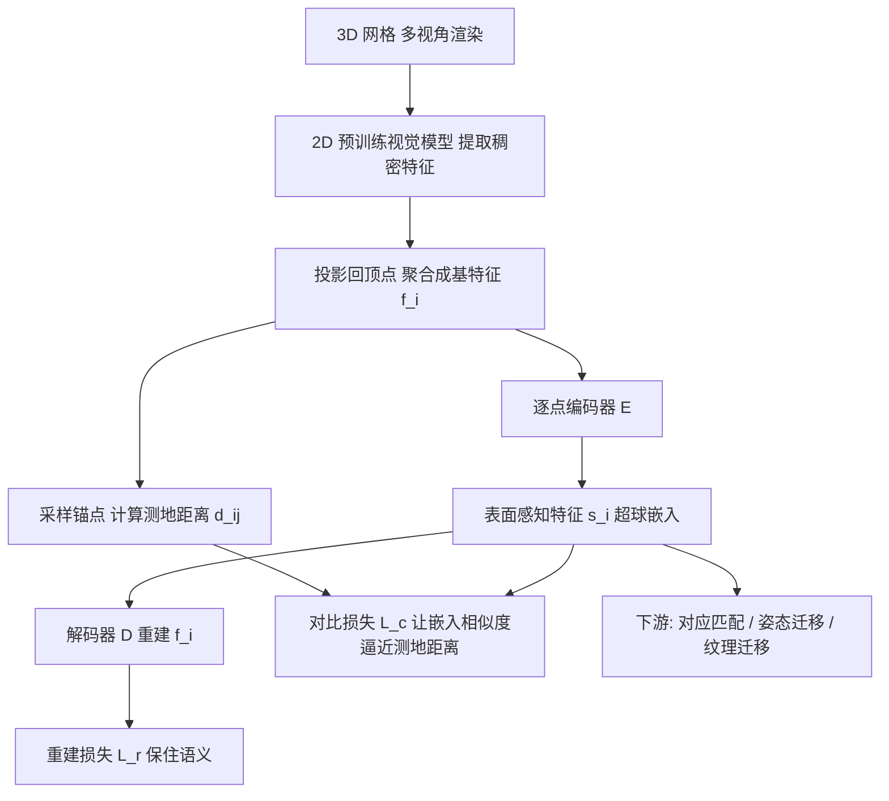

## 一句话总结

通过一个由测地距离引导的自监督对比损失，把从 2D 预训练视觉模型蒸馏到 3D 表面上的语义特征，重新嵌入到一个"表面感知(surface-aware)"的超球空间里，从而区分同类不同实例(如"左手 vs. 右手"),并构建一个让已见与未见 3D 形状都隐式对齐的联合嵌入空间，支撑对应匹配、姿态迁移、纹理迁移等多种下游任务。

## 研究背景

在 3D 配准、姿态对齐、运动迁移以及静/动态三维重建中，建立形状间的语义对应是核心一环。传统几何描述子在非等距(non-isometric)形变下表现不佳；而近来从 2D 视觉模型(DINO、DINOv2、Stable Diffusion 等)蒸馏出的神经特征在跨形状(甚至从猫到狮子)匹配上取得了显著成功。

但这类神经特征存在一个关键短板：它们难以区分同一语义类别下的不同实例。比如"左手"与"右手"在特征空间中高度相似，"paw(爪)"这一强语义概念会盖过左右/前后之分。这种混淆会在下游任务里造成大幅误匹配。已有 2D 研究表明视觉特征其实隐含全局姿态信息、理论上可被消歧,但要在 3D、且在数据稀缺(3D 数据采集与标注困难)的现实条件下做到这点并不容易。

本文的目标就是：在不依赖大规模标注、不需要成对形状、只用少量无配对训练网格的前提下，学到一组能消解同类实例歧义的表面感知 3D 特征，并且在推理时对新的、甚至不完整的形状免微调即可使用。

## 方法

### 整体框架

方法建立在"将 2D 视觉特征重投影到 3D 网格顶点"的既有范式(以 Diff3F 为基特征)之上，再叠加一个逐点的特征自编码器来学习表面感知特征：

1. 多视角渲染 3D 形状，送入预训练 2D 视觉模型得到稠密特征图，经投影纹理映射聚合到每个顶点，得到基特征 $$f_n$$(维度 $$f=2048$$)。
2. 用一个逐点 MLP 编码器 $$E$$ 把基特征压到低维超球嵌入 $$s_n = E(f_n)/\lVert E(f_n)\rvert_2$$(维度 $$s=256$$)。
3. 训练时在单个形状上采样点对，用对比损失强制嵌入空间的余弦相似度逼近这对点在表面上的测地距离；同时用解码器 $$D$$ 重建基特征以保住语义信息。
4. 推理时不再需要测地距离，只有浅层编码器的极小开销。

### 关键设计

对比损失(表面感知的核心)。对每个网格用最远点采样选出 $$A$$ 个锚点 $$p_a$$，计算每个顶点到锚点的测地距离 $$d_{n,a}$$，并按最大值归一化 $$d'_{n,a} = d_{n,a}/\max_{n,a}(d_{n,a})$$ 以去除网格尺度依赖(这让不同比例但形态等价的形状,如大象与长颈鹿,也能泛化)。损失为:

$$L_c = \frac{1}{NA}\sum_n \sum_a \left( d'_{n,a} - \frac{1-\phi(s_n, s_a)}{2}\right)$$

其中 $$\phi$$ 是余弦相似度。它惩罚"嵌入空间里近、但表面上远"的点对(反之亦然),从而把在表面上相距很远的同类部件(如前爪 vs. 后爪)在特征空间中拉开。

重建损失。为保住蒸馏来的语义内容,解码器把 $$s_n$$ 还原为 $$\bar f_n = D(s_n)/\lVert D(s_n)\rvert_2$$,并最小化 $$L_r = \frac{1}{N}\sum_n (1-\phi(f_n, \bar f_n))$$。总损失 $$L = w_r L_r + w_c L_c$$,取 $$w_r = w_c = 1$$ 即可。

设计取舍。编码器是逐点的、不依赖网格完整性或一致拓扑，因此对坐标交换、重姿态、形状不完整都更鲁棒；训练只用形状自身的内在属性(测地距离),不需要成对的源/目标形状,也不需要外在的规范化对齐,便于推广到人形与动物之外的类别(椅子、飞机)乃至跨类映射。超球(角度)嵌入相比欧氏空间更优,已在消融中验证。

## 实验结果

在 3D 对应匹配基准上与多种方法对比(准确率取常用阈值 $$\epsilon = 1\%$$，err 越低越好、acc 越高越好)。本文方法仅用不到 100 个训练样本，却优于用数千样本监督训练的基线,并在多数指标上超过其基特征 Diff3F：

| 方法 | SHREC'19 err↓ | SHREC'19 acc↑ | TOSCA err↓ | TOSCA acc↑ | SHREC'20 err↓ | SHREC'20 acc↑ |
|------|------|------|------|------|------|------|
| 3D-CODED† | 8.10 | 2.10 | 19.20 | 0.50 | - | - |
| DPC† | 6.26 | 17.40 | 3.74 | 30.79 | 2.13 | 31.08 |
| SE-OrNet† | 4.56 | 21.41 | 4.32 | 33.25 | 1.00 | 31.70 |
| Diff3F* | 1.69±1.44 | 26.25±9.30 | 4.51±5.48 | 31.00±15.73 | 5.34±10.22 | 69.50±24.99 |
| Diff3F + FM* | 1.51±1.65 | 21.71±7.12 | x | x | 4.44±7.87 | 58.03±25.94 |
| Ours | 0.43±0.76 | 28.78±9.30 | 1.65±2.15 | 29.35±14.53 | 3.89±8.90 | 73.97±26.47 |
| Ours + FM | 0.24±0.64 | 24.83±6.80 | x | x | 3.54±7.59 | 63.61±24.34 |

(†数据取自 Diff3F 论文;*为本文复现;x 因非流形网格而省略;+ FM 表示与 Functional Maps 结合。)

本文方法在 SHREC'19 与 TOSCA 上取得最低误差,且在约 2% 阈值以上的准确率普遍更高,说明其擅长剔除由部件误匹配造成的离群点。此外,消融显示:只用 $$L_r$$ 时性能接近 Diff3F(说明增益并非仅来自更小的嵌入或训练数据),只用 $$L_c$$ 时准确率下降,二者结合的自编码方案才最优;超球对比损失也优于 RGL / NGL / GSL 等替代损失。

## 亮点与局限

亮点：
- 用测地距离引导的对比损失，把"同类不同实例"这一顽疾在 3D 特征层面解决,且完全自监督、无需成对形状与外在对齐。
- 低数据即可(不到 100 个网格),推理免微调、免测地计算,浅编码器开销可忽略(10k 顶点约 5 毫秒,相对 Diff3F 约 4 分钟)。
- 构建的是联合嵌入空间,天然支持多对多(n-to-n)匹配,并适用于人形、动物、椅子、飞机乃至跨类映射;还保持与逐像素图像特征的兼容性,直接支撑 2D-to-3D 纹理迁移。

局限：
- 继承基特征(Diff3F)的缺点:提取耗时数分钟,对渲染伪影和网格上下颠倒敏感。
- 对既在几何又在语义上各向同性的物体(如圆桌)无法建立一致划分(区分不了桌腿)。
- 依赖语义不同部件间测地距离的一致性,在带噪重建中"部件粘连"(如相触的手)造成的测地捷径会影响效果。

## 延伸思考

该工作把"2D 基础模型的语义先验"与"3D 形状的内在几何约束(测地距离)"以一种优雅的自监督方式缝合起来,本质是用几何度量去"雕刻"预训练特征中已经隐含、却未被显式组织的实例/姿态信息。这提示一个更一般的范式:与其扩大 3D 标注数据,不如设计合适的内在正则把大模型特征"重新排布"到任务所需的结构上。

顺着作者的展望,把这套表面感知特征接到 3D-to-2D 姿态估计、关节体重建、自动绑定(rigging)或 2D-to-3D 提升上,有望提供更具视角一致性的表征;而"圆桌腿无法区分"这一局限也点明了纯内在几何度量的边界——真正对称的结构需要额外的外在信号或语义约定才能打破对称。若未来能在 Objaverse 级别的大规模数据上直接学习具备实例消歧能力的基础特征,或许可省去逐类训练编码器的步骤。
