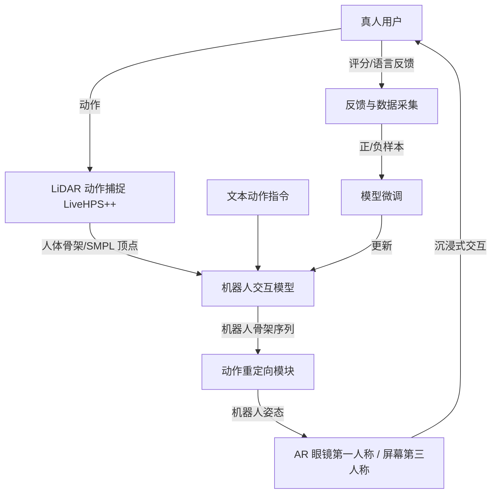

## 一句话总结

SymBridge 提出首个"人在回路"的赛博物理交互系统，借助 AR 让真人与虚拟机器人在真实物理空间中直接互动，并通过实时机器人交互模型与人类反馈驱动的持续微调，逐步推进人机共生。

## 研究背景

要实现"人机共生"，机器人需要能在日常生活中自然、高效地与人交互协作。然而现有机器人仿真器大多只服务于导航、操作、控制等任务，聚焦在没有主动角色的静态环境，无法支持真实的人机交互（HRI）：因为对复杂、动态、闭环的人类交互行为建模极其困难。

近期一些工作开始把真人引入 HRI 仿真，但人类通常只能通过键盘或 VR 界面操控虚拟化身来与仿真机器人协作，关注点在于完成不涉及近距离肢体接触的任务，缺乏真正的 3D 物理交互，难以带来真实、沉浸的人机行为交换。作者据此提出三个核心挑战：如何让真人在物理空间中与虚拟机器人产生真实交互体验；如何驱动虚拟机器人实时响应人类动作；如何通过持续交互实现算法的自我进化。

## 方法

SymBridge 的整体框架由两条循环组成：蓝色循环负责实时人机交互，黄色循环负责基于反馈的模型自适应。人类佩戴 AR 眼镜在真实环境中与虚拟机器人互动，LiDAR 动捕模块感知人类动作，机器人交互模型生成响应动作并渲染回 AR 界面；同时系统记录交互数据与人类反馈，用于持续微调交互模型。

关键设计：

- **真实交互界面（LiDAR + AR）**：用 Ouster OS1-128 LiDAR 采集人体点云近似机器人感知，兼具高精度、隐私保护（不采集外观纹理）和光照鲁棒性，用户可在距传感器 5~7 米内活动；AR 眼镜（PICO4 Ultra）把虚拟机器人以照片级真实感渲染进用户环境，并额外提供 RGBD 相机融合的第三人称视角。

- **机器人交互模型（在线实时生成）**：以文本指令、历史机器人关节、观测到的人体骨架与 SMPL 网格顶点为输入，包含四个紧耦合模块。其中 **Affordance Predictor** 预测机器人末端执行器（手）到每个人体顶点的稠密欧氏距离场 $$A_{t+1\sim t+k}$$，用于推理社交上合理、物理上可行的接触点；**MRHF Learner**（多分辨率人体特征学习器）用分层编码器提取低/中/高层时序特征并拼接成 $$F^{MR}_{H,\,t-n\sim t}$$，兼顾局部动作细节与长期行为意图。

- **Robot Rollout Loop（逐帧滚动生成）**：MRHF-enhanced 编码器融合历史机器人关节与多分辨率人体特征，Affordance-guided 预测器再融合可供性与动作嵌入得到 $$F^{R'}_{t+1\sim t+k}=\mathrm{Predictor}_{Affordance}(F^{R}_{t-n\sim t},A_{t+1\sim t+k},F_C)$$，最后由 MRHF-enhanced 解码器输出未来机器人关节序列。采用后退时域策略：预测多帧保证平滑，但只执行下一帧 $$J^{R}_{t+1}$$，其余丢弃并每步重规划，兼顾长期连贯与实时响应，同时抑制误差累积。

- **反馈驱动自适应**：交互中记录点云、人机姿态与人类评分/语言反馈，按评分将数据分为正、负样本，采用 $$L=L_{pos}-\alpha L_{neg}$$ 的损失做监督微调，让机器人行为逐步对齐用户偏好，形成"越用越好"的进化机制。

## 实验结果

在 Inter-HRI 基准（由人-人交互数据集 Inter-X 经离线重定向生成，含 Unitree H1 与 LEJU Kuavo 两类机器人）上，与四个近期方法对比，SymBridge 在动作精度、接触质量与生成保真度上全面领先。

| Robot / Method | PA-MPJPE↓ | MPJPE↓ | Traj↓ | Orie↓ | C_prec↑ | C_F1↑ | FID↓ | R-score↑ |
|---|---|---|---|---|---|---|---|---|
| H1 · JRT | 3.35 | 11.99 | 0.222 | 36.51 | 0.839 | 0.818 | 0.333 | 0.420 |
| H1 · MRT | 3.16 | 11.31 | 0.220 | 35.63 | 0.852 | 0.827 | 0.320 | 0.424 |
| H1 · ReGenNet | 5.06 | 18.20 | 0.383 | 56.05 | 0.807 | 0.646 | 0.763 | 0.363 |
| H1 · SAST | 5.31 | 19.77 | 0.322 | 46.69 | 0.805 | 0.772 | 0.527 | 0.409 |
| H1 · Ours | 2.70 | 9.52 | 0.125 | 25.95 | 0.842 | 0.855 | 0.178 | 0.478 |
| Kuavo · JRT | 3.11 | 10.82 | 0.199 | 32.52 | 0.849 | 0.817 | 0.320 | 0.445 |
| Kuavo · MRT | 2.96 | 10.54 | 0.206 | 35.18 | 0.836 | 0.816 | 0.294 | 0.447 |
| Kuavo · ReGenNet | 4.05 | 14.72 | 0.320 | 51.60 | 0.783 | 0.708 | 0.562 | 0.397 |
| Kuavo · SAST | 5.15 | 19.52 | 0.352 | 53.12 | 0.792 | 0.746 | 0.553 | 0.417 |
| Kuavo · Ours | 2.46 | 8.74 | 0.122 | 24.77 | 0.844 | 0.853 | 0.178 | 0.498 |

补充结果：30 人主观评测（5 分 Likert）中本方法平均 4.5 分，最强对手 JRT 仅 2.46 分。系统整体可达 40FPS、端到端延迟低于 0.2 秒；50 人用户实测各维度评分均在中等水平以上，可用性与继续使用意愿较高。技能增强实验（Table 2）显示，随着微调数据规模增至约 10000 条，Cross Categories 与 Cross Domain 两种设置下各项指标持续改善。

## 亮点与局限

亮点：

- 首个支持真人与虚拟机器人在真实物理空间做 3D 近距离肢体交互的人在回路系统，把 LiDAR 动捕、AR 渲染、实时生成与反馈微调打通成闭环。
- 交互模型把空间可供性推理（Affordance Predictor）与多尺度时序理解（MRHF Learner）协同融合，并用后退时域滚动实现实时性与连贯性的平衡，指标显著优于分开处理两方面的前作。
- 提供了 Inter-HRI 基准与较完整的评测方法，并在真实 LEJU Kuavo 机器人上验证了虚拟反应可迁移到实机。

局限：

- 当前仅支持单一活跃用户，且用户必须处于 LiDAR 视线内、不被遮挡；无人检测时预测暂停、机器人静止。
- 用户实测显示交互仍可被区分于真实的人-人交互，实时性仅为中等水平；实机部署时下半身动作还需借助默认离线仿真软件微调以保持平衡。
- 训练用的 GT 机器人动作来自人-人数据的离线重定向而非真实人机交互数据。

## 延伸思考

该工作把"仿真器无法容纳真人"这一 HRI 痛点，用 AR + LiDAR 的赛博物理界面绕开，思路上把"数据采集—模型进化"变成可持续运转的飞轮，很契合具身智能对交互数据稀缺的焦虑。后续若能引入可穿戴触觉传感增强接触真实感、并用基于强化学习的在线微调替代离线监督，有望缩小与真实人-人交互的差距；而单用户、需无遮挡视线等约束，也提示多用户、多传感器融合与鲁棒感知是走向真实服务场景的关键下一步。
