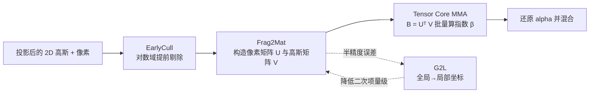

## 一句话总结

TC-GS 把 3D Gaussian Splatting 光栅化中最耗时的 alpha 计算改写成矩阵乘法，从而调用平时在 3DGS 里闲置的 Tensor Core，做成一个算法无关、即插即用的加速模块，为现有各类 3DGS 加速器再叠加约 2× 提速、整体最高可达 5.6×，且几乎不损失渲染质量。

## 研究背景

3D Gaussian Splatting（3DGS）用显式高斯基元实现接近 NeRF 的质量与更快的优化，但渲染速度受限于庞大的参数量与低效的光栅化流水线。已有加速工作大多聚焦在削减冗余计算，却忽视了现代 GPU 上最强的算力单元——Tensor Core（TCU），使其在 3DGS 中长期空闲。

作者对流水线做了细粒度耗时分析，指出条件式 alpha 混合（conditional alpha-blending）是主要瓶颈，它分三步：

- **Alpha 计算**：对每个高斯-像素对求局部不透明度；
- **剔除（Culling）**：丢弃 alpha 低于阈值 $$\frac{1}{255}$$ 的片元；
- **混合（Blending）**：把存活片元按深度合成为像素颜色。

作者进一步把片元分成三类：被混合的（blended）、被剔除的（culled）、被跳过的（skipped，因透射率 $$T<0.0001$$ 提前终止，无计算开销）。测量发现超过 80% 需剔除的高斯-像素对仍留在流水线里，alpha 计算与剔除两步作用在 blended 与 culled 两类片元上，是真正的计算大头。TCU 只支持矩阵乘累加（MMA，即 $$D = A\times B + C$$），难以直接套用到 alpha 计算这类非 GEMM 运算，这正是本文要解决的错配问题。

## 方法

TC-GS 由三个核心组件构成：EarlyCull（提前剔除以减少指数运算）、Frag2Mat（把 alpha 计算重构成矩阵乘法以喂给 Tensor Core）、G2L（全局到局部坐标变换以适配半精度）。

### 3DGS 渲染基础

每个投影高斯在像素 $$p$$ 处的局部不透明度为

$$\alpha_{i,j} = o_j \exp\!\left(-\tfrac{1}{2}(\mu'_j - p_i)^{T}(\Sigma'_j)^{-1}(\mu'_j - p_i)\right)$$

当 $$\alpha_{i,j} < \frac{1}{255}$$ 时被剔除，存活高斯按透射率累积合成颜色

$$C_i = \sum_{j=1}^{n(\mathcal{T})} c_j\, \alpha_{i,j}\, T_{i,j}, \qquad T_{i,j} = \prod_{k=1}^{j-1}(1 - \alpha_{i,k})$$

### 关键设计一：EarlyCull —— 在对数域提前剔除

先把 alpha 写成指数形式 $$\alpha_{i,j} = e^{\beta_{i,j}}$$，其中

$$\beta_{i,j} = \ln(o_j) - \tfrac{1}{2}(\mu'_j - p_i)^{T}(\Sigma'_j)^{-1}(\mu'_j - p_i)$$

于是剔除条件等价地变成对指数的线性判断

$$\beta_{i,j} < -\ln(255)$$

这样可以在昂贵的 exp 指令执行之前就滤掉不可见高斯，大幅减少 exp 发射数量。由于 culled 片元占比很大，这一步对整条流水线都有明显收益。

### 关键设计二：Frag2Mat —— 把 alpha 计算拟合成 MMA

核心观察是：指数 $$\beta$$ 可以写成像素坐标的二次多项式，从而把「只依赖像素」与「只依赖高斯」两部分解耦：

$$\beta = v_0 + v_1 p_x + v_2 p_y + v_3 p_x^2 + v_4 p_x p_y + v_5 p_y^2$$

其中系数只由高斯参数决定（记 $$\Sigma'^{-1}$$ 的元素为 $$\sigma_{11},\sigma_{12},\sigma_{22}$$）：

$$v_0 = \ln(o) - \tfrac{1}{2}\mu'^{T}\Sigma'^{-1}\mu', \quad v_1 = \sigma_{11}\mu'_x + \sigma_{12}\mu'_y, \quad v_2 = \sigma_{12}\mu'_x + \sigma_{22}\mu'_y$$

$$v_3 = -\tfrac{1}{2}\sigma_{11}, \quad v_4 = -\sigma_{12}, \quad v_5 = -\tfrac{1}{2}\sigma_{22}$$

这正好是两个向量的点积 $$\beta_{i,j} = u_i^{T} v_j$$，其中像素向量与高斯向量分别为

$$u = \big(1,\; p_x,\; p_y,\; p_x^2,\; p_x p_y,\; p_y^2\big)^{T}, \qquad v = \big(v_0,\; v_1,\; v_2,\; v_3,\; v_4,\; v_5\big)^{T}$$

每个像素向量、每个高斯向量都只需算一次。把它们分别堆叠成矩阵 $$U \in \mathbb{R}^{6\times m}$$（$$m$$ 为 tile 内像素数）与 $$V \in \mathbb{R}^{6\times n}$$（$$n$$ 为覆盖该 tile 的高斯数），指数矩阵便可用一次矩阵乘得到

$$B = U^{T} V$$

从而让 Tensor Core 同时算出 $$m$$ 个像素与 $$n$$ 个高斯的全部 $$\beta$$。实现上由于 TCU 不支持长度为 6 的 MMA，作者用零填充对齐到长度 8：把 $$v_0$$ 拆成 $$\frac{v_0}{3}$$ 复制三份、并相应复制 $$u$$ 中的常数项 1，既补齐长度又顺带降低元素绝对值以减小舍入误差。

### 关键设计三：G2L —— 适配半精度的坐标变换

Tensor Core 输入只接受 FP16 或 TF32，机器精度 $$\varepsilon_H = 9.77\times 10^{-4}$$ 远大于 FP32 的 $$\varepsilon_F = 1.19\times 10^{-7}$$，且误差对输入绝对值敏感。像素坐标范围是 $$[0,w]\times[0,h]$$，其二次项 $$p_x^2, p_x p_y, p_y^2$$ 可达百万量级，不仅带来灾难性舍入误差，还会超出 FP16 表示范围而溢出。

G2L 把 tile 内像素映射到以 tile 左上角 $$p(\mathcal{T})$$ 为原点的局部坐标：

$$\Delta p = p - p(\mathcal{T}), \qquad \Delta \mu' = \mu' - p(\mathcal{T})$$

由于相对位置不变 $$\Delta\mu' - \Delta p = \mu' - p$$，Frag2Mat 在局部坐标下依然成立。每个 tile 为 $$16\times 16$$，故 $$\Delta p \in [-8,8]^2$$，像素向量元素不超过 64，既避免 FP16 溢出，又把二次项舍入误差从 $$O(h^2 + hw + w^2)\varepsilon_H$$ 降到线性的 $$O(h + w)\varepsilon_H$$，在 FP16 下也能得到高质量渲染。

## 实验结果

在 NVIDIA A800（80GB，432 个 Tensor Core，峰值 624 TFLOPS FP16）上，用与 3DGS 相同的 Mip-NeRF360、Tanks & Temples、Deep-Blending 数据集评测。TC-GS 作为模块分别接入 3DGS、FlashGS、Speedy-Splat、AdR-Gaussian 四种流水线。

整体渲染 FPS（以 Deep-Blending 为例）：

| 方法 | FPS↑ | PSNR↑ | 接入 TC-GS 后 FPS↑ | 加速 |
|------|------|-------|------|------|
| 3DGS | 131.4 | 29.80 | 286.8 | 2.185× |
| FlashGS | 563.6 | 29.79 | 735.8 | 1.305× |
| Speedy-Splat | 315.8 | 29.80 | 580.0 | 1.84× |
| AdR-Gaussian | 324.2 | 29.81 | 612.1 | 1.89× |

- 除已高度软件流水线化的 FlashGS 外，接入 TC-GS 大致把帧率翻倍；FlashGS + TC-GS 取得最优绝对性能（479–736 FPS），相对原始 3DGS 提速 3.3–5.6×。
- 单看 alpha-blending 阶段，接入后获得 2.03–4.76× 的提速（如 AdR-Gaussian 上最高 4.76×）。
- PSNR / SSIM / LPIPS 在接入前后几乎无差异，属无损加速；细微差异来自硬件指令集差异与浮点精度转换。

消融实验：

- EarlyCull 单独带来 1.06–1.51× 提速，Frag2Mat（含 G2L）单独带来 1.97–2.24× 提速，二者叠加时 Frag2Mat 是主要贡献者。
- G2L 的作用至关重要：直接用 FP16 而不做坐标变换会让 PSNR 崩到约 8 dB（甚至 6 dB），TF32 也有明显质量下降；FP16 + G2L 则在保持与 FP32 几乎相同质量（如 drjohnson 29.46 vs 29.48）的同时拿到最高 FPS。

## 亮点与局限

亮点：
- 首次把 Tensor Core 用于 3DGS 的 alpha-blending，拓展了 TCU 在非 GEMM 计算上的适用边界，填补了这一空白。
- 算法无关、即插即用：无需改动原始 3DGS 模型或训练流程，可正交叠加在压缩、冗余剔除等各类加速器之上，同时适用于推理与训练。
- G2L 用简单的局部坐标变换把半精度舍入误差从二次降到线性，是让 FP16 Tensor Core 方案落地的关键工程点。

局限：
- 对已做过精细软件流水线优化的 FlashGS，收益较小（平均约 1.38×），因为二者优化维度不同但部分重叠。
- 优化后 preprocess 阶段（含视图变换等矩阵运算）的相对占比上升，成为新的开销点，作者指出这本身也可用 Tensor Core 进一步优化。
- 要在其上再叠加类 FlashGS 的流水线技术，需要 warp 级而非线程级的流水线设计，尚未实现。

## 延伸思考

- 「把非 GEMM 的核心算子重写成矩阵乘以榨干 Tensor Core」的思路，能否推广到 3DGS 的其他阶段（如 preprocess 的视图/协方差变换、排序）乃至 2D GS、各向异性泼溅、动态场景 GS。
- G2L 揭示了半精度硬件加速中「降低输入绝对量级」的通用价值，这种坐标/数值重参数化技巧对其他要迁移到 TCU 的图形算法或许同样适用。
- TC-GS 与「减少高斯数量」类方法正交，二者组合后的加速上限，以及在边缘设备、大规模实时场景上的端到端收益值得进一步验证。
