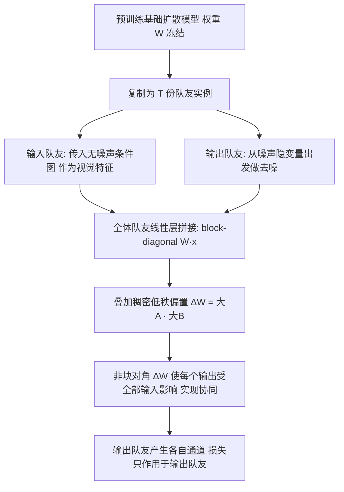

## 一句话总结

本文提出 Teamwork：一个统一、高效的框架，通过运行多份同一预训练扩散模型的实例（称为"队友"，teammates），并用一种新颖的 LoRA 变体同时完成"任务适配"与"实例间协同"，从而在不改动基础模型架构的前提下扩展扩散模型的输入/输出通道数，适用于图像修复、SVBRDF 估计、本征图像分解、神经着色、本征图像合成等多种生成与逆渲染任务。

## 研究背景

大规模预训练文生图扩散模型蕴含强先验，对许多图形学应用很有价值，但这些模型通常只接受三通道输入、输出三通道 RGB。而大量图形任务需要额外的输入或输出通道：

- 输入侧：神经着色需要额外的条件图（如本征分量）作为控制信号。
- 输出侧：SVBRDF 估计要同时输出漫反射率、镜面反射率、粗糙度、法线等十余个通道；本征图像分解要拆出多个反射分量。

现有做法各成一派、彼此割裂：

- 输入扩展常用零卷积扩头再微调（易过拟合、破坏先验），或 ControlNet／ControlLoRA（缓解过拟合但无法扩展输出通道）。
- 输出扩展缺乏标准方案，依赖特制手段，如专用提示词切换任务，或共享／联合注意力（Joint Attention）。其中联合注意力虽灵活，但计算量随实例数呈二次增长，且它只解决协同、仍需另配适配方法。
- 同时扩展输入与输出通道，就得拼凑多种异构方法，在先验保持程度、过拟合控制、训练成本上参差不齐。

作者的目标是：用一个统一框架同时解决"输入扩展、输出扩展、任务适配、实例间协同"四件事，且保持 LoRA 的紧凑与高效。

## 方法

核心思想：把通道扩展重新表述为"运行 $$T = \lceil c/3 \rceil$$ 份同一基础扩散模型的适配实例"，每个队友负责三个输入或输出通道；这些队友之间需要协同以建模跨通道相关性。Teamwork 用一个作用在全体队友之上的低秩偏置矩阵，同时实现适配与协同。

### 关键设计 1：用低秩偏置同时做适配与协同

对线性层的冻结权重 $$W \in \mathbb{R}^{m \times n}$$，把 $$T$$ 个实例的输入输出拼接后，基础运算等价于块对角结构 $$y = \mathrm{block}(W)\,x$$，此时各实例互不感知（等同 batching）。Teamwork 加上一个偏置：$$y = \mathrm{block}(W)\,x + \Delta W x$$，并用低秩表示 $$\Delta W = [A_1 \cdots A_T]^\top [B_1 \cdots B_T]$$。关键在于：整体 $$\Delta W$$ 不再是块对角的，因此每个输出 $$y_i$$ 都受到全部输入 $$x_j$$ 的影响，特征信息得以在队友间流动，这就是协同。相比之下，对每个队友单独套 LoRA 会得到块对角的 $$\Delta W = \mathrm{block}_i(A_i B_i)$$，各队友仍相互隔离。

### 关键设计 2：输入队友当作"视觉模型"而非"生成模型"

扩展输入通道时，为每三路条件加一个输入队友。作者指出扩散模型提取的特征即使在无噪输入下也对条件化有意义，因此输入队友在每个扩散步都传入无噪声条件图（而非从噪声隐变量出发），其输出被忽略、不定义损失。但输出队友的损失仍会经由稠密偏置 $$\Delta W$$ 反传到输入队友，使其得到适配。

### 关键设计 3：队友的动态激活

Teamwork 支持在推理与训练时动态启用／停用队友：只需在计算 $$\Delta W x$$ 时纳入活跃队友对应的低秩因子 $$A_i$$、$$B_i$$ 与输入 $$x_i$$。这带来两个好处：推理时可灵活开关通道；训练时可在通道子集不同的异构数据集上，逐样本激活当前可用通道，从而最大化利用合并训练集的信息。

### 关键设计 4：与 Joint Attention 互为对偶，且成本更低

Joint Attention 通过替换自注意力层在实例间交换信息，计算量随实例数二次增长。Teamwork 则通过线性层特征共享信息，是其"对偶"：协同层数量是注意力方案的四倍（每个注意力块含四个线性层），协同与适配一体完成，且计算成本与"对每个实例单独套常规 LoRA"相同，即随队友数线性增长。实现上借助 batching 的 batch trick，把 Teamwork 感知的低秩运算跨批次维度执行；代价是微批大小被限为 1，需用梯度累积（实验用 16× 累积）。

## 实验结果

在单图 SVBRDF 估计任务上，作者用相同测试集比较了 MatFusion、Joint Attention 协同与 Teamwork 协同（不同基础模型）。指标为重渲染误差（128 个随机点光下的平均 LPIPS）与各反射分量的 RMSE（漫反射／镜面／粗糙度／法线），越低越好。下表为 colocated 光照条件下的结果：

| 光照 | 基础模型 | 协同方式 | 重渲染误差↓ | Diff. RMSE↓ | Spec. RMSE↓ | Rough. RMSE↓ | Norm. RMSE↓ |
| --- | --- | --- | --- | --- | --- | --- | --- |
| Coloc. | MatFusion | 无 | 0.214 | 0.071 | 0.0958 | 0.115 | 0.0562 |
| Coloc. | SDXL | Attn | 0.216 | 0.0471 | 0.0861 | 0.105 | 0.0454 |
| Coloc. | SD3 | Attn | 0.214 | 0.0682 | 0.117 | 0.145 | 0.0481 |
| Coloc. | SDXL | Team. | 0.204 | 0.0572 | 0.0876 | 0.105 | 0.0416 |
| Coloc. | SD3 | Team. | 0.188 | 0.0609 | 0.0835 | 0.12 | 0.0464 |
| Coloc. | Flux | Team. | 0.195 | 0.0653 | 0.101 | 0.141 | 0.0454 |

Teamwork 各变体在重渲染误差上全面优于 MatFusion 与 Joint Attention 变体，各分量精度也具竞争力。更关键的是训练效率：Teamwork 仅用 4,000 步（对 MatFusion 的 672,000 步）、更少样本，训练耗时 21／18／85 GPU 小时（SDXL／SD3／Flux，512 分辨率），相比 MatFusion 约 400 GPU 小时（256 分辨率）实现约 5～20× 加速。在本征图像分解上，专门在 InteriorVerse 上训练的 Teamwork 大幅超越 RGB→X 等方法；在 HyperSim、Infinigen 上的跨域测试也显示更好的泛化。消融实验进一步表明：去掉协同后精度与输出通道间一致性均显著下降（联合 albedo×shading 重建误差 LPIPS 0.1127／RMSE 0.1272，对无协同的 0.2443／0.2617）。

## 亮点与局限

亮点：

- 用一个统一框架同时解决输入扩展、输出扩展、任务适配与实例协同，无需改动基础模型架构，可无缝套用 SDXL、SD3、Flux 等不同底座。
- 在常规 LoRA 之上极易实现，计算与显存开销随队友数线性增长，相比 Joint Attention 的二次复杂度可扩展性更好。
- 支持队友动态开关，天然适配"通道子集各异"的异构数据集训练，并在推理时提供灵活性。
- 在多任务上以远少的训练迭代取得相当或更优的效果，训练成本大幅下降。

局限：

- Teamwork 强烈偏好像素对齐的输入与输出；对于非像素对齐的输入，作者预期 Joint Attention 会更有优势。
- batch trick 把微批大小限制为 1，必须依赖（分布式）梯度累积来训练。
- 动态激活会影响精度：单独激活各队友会实质关闭协同、显著掉点；用 drop-out 训练可缩小顺序推理与联合推理的差距，但整体性能也随之下降，趋近无协同模型。
- 最优秩与训练步数与任务相关：秩过低限制适配能力，过高则自由度过大、易陷入次优局部最优。

## 延伸思考

Teamwork 最优雅之处在于对"协同"的重新诠释：不再借助昂贵的跨实例注意力，而是把一个大偏置矩阵做低秩分解，让其非块对角结构自然地在所有队友间搬运信息，从而把协同的边际成本压到几乎为零。这一"共享线性特征而非共享注意力"的思路，本质上把多任务／多通道的耦合建模在参数层面而非激活层面完成，因而天然线性可扩展。它提示我们：在利用大预训练模型做逆渲染／多输出任务时，"如何低成本协同多份实例"可能比"设计更复杂的单模型"更划算。像素对齐的强先验既是它在图形任务上高效的原因，也划定了它的适用边界；把这种低秩协同推广到非对齐、跨模态或时序场景，或与动态激活、drop-out 训练更好地结合以兼顾灵活性与精度，会是值得探索的方向。
