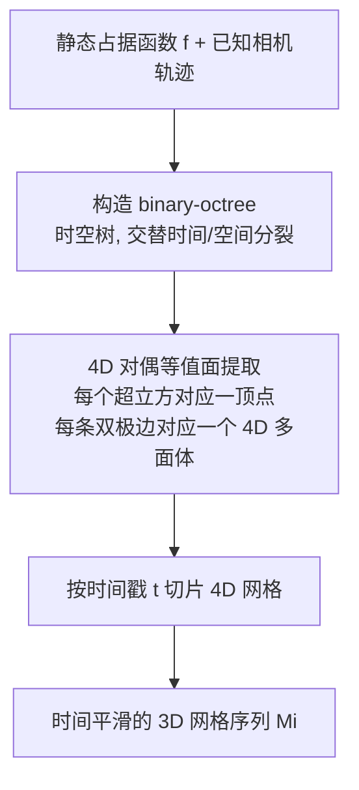

## 一句话总结

提出 BinocMesher，用一种名为 binary-octree 的时空树结构做 4D 网格提取，再按时间切片得到 3D 网格，从而为无界程序化场景的长距离相机路径生成时间上平滑、无跳变（popping）的网格序列。

## 研究背景

程序化占据函数（procedural occupancy function）$$f: \mathbb{R}^3 \mapsto \{0, 1\}$$ 是创建 3D 场景的紧凑而灵活的表示，广泛用于电影、游戏以及 3D 视觉的合成数据集。为了光栅化和后续渲染，通常需要从占据函数中提取三角网格。

无界场景配合长距离相机轨迹（如穿越森林或山脉飞行）给网格提取带来独特挑战：

- 用单个静态全局网格（如 OcMesher）表达整条路径所需的全部几何细节，规模可能大到超出提取算法和渲染引擎的承载能力。
- 为不同相机视角分别提取独立网格虽可控制规模，但网格之间切换时会产生严重的跳变（popping）伪影，除非使用过高分辨率或引入平滑过渡机制。
- 传统的渐进网格（progressive mesh）与 geomorph 方法需要先构造最高 LOD 的完整网格再抽稀，对程序化占据函数描述的大场景而言中间网格不可承受。

作者假设相机路径事先已知（适用于动画、视频制作、合成数据生成等离线场景），目标是给定静态占据函数与一串时间戳相机 $$\{t_i, i = 1, 2, \ldots, L\}$$，提取一个时间上平滑的网格序列 $$\{M_i\}$$。

## 方法

### 整体框架

核心思想借鉴 Ponchio 与 Hormann 的观察：两个 3D 网格之间的插值，等价于对一个嵌入在 4D 时空中的 4D 网格做切片。作者把该思路从均匀网格推广到多分辨率网格，需要解决相邻区域分辨率不同时的切片难题，为此提出 binary-octree。

整个流程分三步：先构造 binary-octree，再用对偶等值面提取（dual contouring）从时空树角点的占据值中提取 4D 网格，最后按不同时间戳对 4D 网格切片得到 3D 网格。

### 关键设计

1. **Binary-octree 时空树结构**：内部节点只做两类分裂之一——空间分裂（8 个子节点，均匀切分空间、时间范围不变）或时间分裂（2 个子节点，空间范围不变、时间范围二分）。相比 16 叉的 4D 超八叉树（要求所有时刻做统一空间细分），binary-octree 结合了 K-D 树与八叉树的特点，每次时间分裂允许两个子节点采用不同的空间细分，对长相机轨迹更省内存。

2. **时间分裂准则**：遵循"最少时间分裂"与"时间连贯"两个目标。节点仅在其时间窗内的相机投影角直径 $$\mathcal{D}_N^{(i)} = S_N / \lVert x_i - X_N \rVert$$ 存在一段"小直径子序列"（小于最大直径一半）、且该子序列时长超过过渡控制参数 $$\delta_t$$ 时才做时间分裂，从而避免在整段序列上都做等价的空间细分。参数 $$\delta_t$$ 在内存效率与时间连贯之间权衡：相邻 LOD 之间的变换至少要花 $$\delta_t$$ 的时长。构造采用最大优先队列、时间/空间分裂交替进行的粗到细算法。

3. **4D 对偶等值面提取与顶点定位**：在 $$K$$ 维对偶等值面提取中，每个与表面相交的超立方对应一个网格顶点，每条双极边（连接不同占据值）对应一个 $$(K-1)$$ 维多面体。4D 情形下双极边对应嵌入 4D 空间的多面体（一般是 8 顶点的六面体）。由于占据函数是逐点二值的，无法用插值定位顶点，作者改用二分搜索（bisection）把顶点投影到接近真实表面处，消除把顶点放在超立方中心导致的"阶梯"伪影。

4. **网格切片与高效实现**：在 $$t = t_1$$ 平面切多面体时，对满足 $$t_u \le t_1 < t_v$$ 的边 $$(u, v)$$ 放置交点，每个面产生 0、2 或 4 个交点连成多边形。工程上引入虚拟网格（virtual grid）、视锥外收缩、深度缓冲可见性剔除来降本；并按时间范围用二进制编码对节点分组、只按需加载分组，使内存与序列长度无关，整体时间复杂度为 $$O(T \log T)$$（$$T$$ 为相机序列时长），可优雅扩展到长序列。

## 实验结果

在 Infinigen 程序化地形上构建 Forest、Mountain、Arctic、Cave、Beach、City 等场景（每段视频 20 秒、24 fps、960×540），设 $$\delta_t = 1\,\text{s}$$、直径阈值 $$\hat{D}_2 = 3\,\text{px}$$。视觉一致性用相邻帧经光流 warp 后的 SSIM 度量：$$S_i = \mathrm{SSIM}(I_i, \mathrm{warp}(I_{i+1}, F_{i \to i+1}))$$。基线为 Spherical Mesher 与 OcMesher（子序列长度 24、96 帧）。

下表为 Forest 场景四种方法的计算开销对比（在 64 核 12 代 Intel Core i7 + RTX 2080 上测得）：

| 指标 | Spherical | OcMesher-24 | OcMesher-96 | Ours |
| --- | --- | --- | --- | --- |
| 网格生成（摊销, 秒/帧） | 21 | 7 | 3 | 23 |
| 渲染（秒/帧） | 254 | 193 | 220 | 199 |
| 总计（秒/帧） | 275 | 200 | 223 | 222 |
| 顶点总数（所有块） | 565 M | 105 M | 55 M | 81 M |
| 平均每帧顶点数 | 9.1 M | 5.2 M | 10.9 M | 9.3 M |

Spherical 因高分辨率抑制跳变而总耗时最长却仍有明显 popping；OcMesher 网格生成更快，但子序列越长每帧网格越大、渲染更慢且更易超内存。本方法在可比总开销下取得显著更好的视觉一致性：其 $$S_i$$ 曲线持续保持高位、只有极小的谷值，而基线因按子序列换网格出现周期性"谷值"（即 popping 事件）。此外，$$\delta_t$$ 越大 SSIM 谷值越少但每帧网格越大，$$\delta_t = 1\,\text{s}$$ 被选为平衡点。

## 亮点与局限

亮点：

- 首次把多分辨率网格提取从"固定 LOD 的静态网格"推进到"随相机动态变化的时间平滑 LOD"，用 4D 切片这一优雅视角统一处理。
- binary-octree 兼顾内存与时间连贯，时间复杂度 $$O(T \log T)$$，内存与序列长度无关，可扩展到长轨迹。
- 在可比开销下视觉一致性明显优于 Spherical 与 OcMesher。

局限：

- 仅适用于预定义相机轨迹（及其周围模糊区域），无法用于游戏等交互式应用。
- 若占据函数本身随时间变化（真正的动态场景），LOD 过渡会退化为每帧一棵八叉树；动态效果目前只能通过位移贴图或独立动画元素叠加。
- 仍存在由垂直于时间轴的多面体面产生的微小 popping（表现为 SSIM 小谷值），需通过把这些面挤出成锥体的扩展来缓解。

## 延伸思考

将时空树的思想迁移到直接光线步进（ray-marching）可能是有趣方向：论文指出可设想一种混合方案，借助类似 binary-octree 的时空结构实现可变步长，从而在无需显式网格的情况下兼顾一致性与效率。此外，"模糊相机路径"扩展提示了一条通向准交互应用的路径——只要真实相机停留在预采样的模糊区域附近，就能提供足够分辨率的网格，超出区域则平滑降质。更广义地看，"把时间当作额外一维、对高维结构切片"的范式或可用于其他需要时间连贯的几何/外观 LOD 问题。
