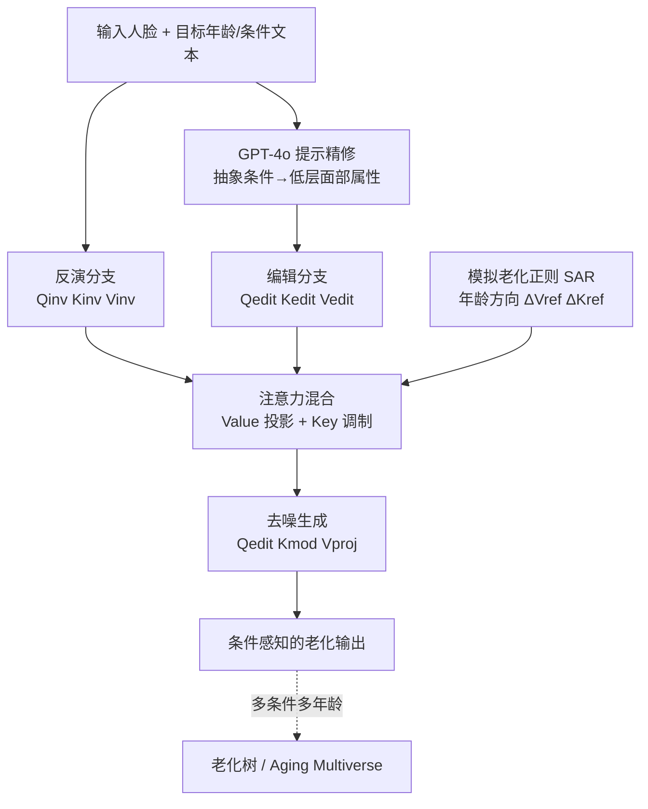

## 一句话总结

Aging Multiverse 把\"单张人脸\"的老化从一条确定性\"老化线\"扩展成一棵可条件控制的\"老化树\"：无需训练，仅在推理时对 Rectified Flow 模型的注意力做混合与正则，就能在保持身份的同时，按环境、健康、生活方式等外部条件生成多条可信的老化轨迹。

## 研究背景

人脸年龄变换在数字叙事、健康教育、个性化可视化中都有需求。以往方法大多在 FFHQ 这类大规模人脸数据集上预训练，学到一个全局老化先验，把老化建模成单一确定路径，既不考虑老化的内在多样性，更无法按\"体重增加\"\"脱发\"\"酗酒\"\"护肤\"\"日晒\"等外部条件来分叉。

作者指出，从单图生成\"条件感知\"的老化路径，本质上要同时满足三个相互竞争的目标：强身份保持、准确的年龄编辑、以及与文本条件对齐的属性注入。现有两类方法各有短板：专门的年龄变换方法（如 FADING）能保身份、会变老，但无法接受外部条件提示；通用图像编辑方法能处理条件，却难以三者兼顾——RF-Solver-Edit 能保身份但几乎不变老、不对齐条件，FlowEdit 能条件老化却丢身份。于是传统的\"反演-可编辑性\"二元权衡，在这里升级为\"身份-年龄-外部条件\"的三方平衡。

作者的目标是提出一个训练无关的方法，把任意输入人脸变换到任意目标年龄（20–90 岁）下的任意文本条件，即插即用地兼容现有 DiT/Flux 类模型，且计算开销小。

## 方法

整体框架建立在二阶 Rectified Flow 编辑器 RF-Solver-Edit 之上：先把输入图反演到噪声空间，再在目标文本条件下去噪编辑。核心创新是在推理时对注意力块的 Key / Value 张量做\"混合\"与\"正则\"，无需任何再训练。

关键设计：

1. 提示精修（Prompt Refinement）。文生图模型难以理解\"酗酒\"这类抽象条件。作者用 GPT-4o 把高层条件翻译成低层面部属性，例如把\"40 岁酗酒男性\"扩写成\"因长期酗酒而皮肤苍白、眼窝深陷、面部皱纹的 40 岁男性\"，让模型更好地把外观和条件对齐。

2. 注意力混合解决反演-可编辑性权衡（Attention Mixing）。RF-Solver-Edit 直接用反演的 Value 替换编辑的 Value 来保身份，但会过拟合原图、几乎不变。作者改为对二者做调制融合：

   - Value 投影：把 $$V_{inv}$$ 向 $$V_{edit}$$ 做正交投影 $$V_{proj} = \alpha V_{edit}$$，其中 $$\alpha = \frac{\langle V_{inv}, V_{edit}\rangle}{\langle V_{edit}, V_{edit}\rangle}$$。直觉是：编辑方向与身份特征一致就放大，冲突就抑制以免丢身份。
   - 文本嵌入掩码：由于 DiT 块同时处理文本与图像嵌入，计算 $$\alpha$$ 时把 $$V_{inv}$$ 的文本通道掩掉，只融合图像特征；算完再把这些通道的 $$\alpha$$ 置 1，保住来自 $$V_{edit}$$ 的提示语义。
   - Key 调制：只改 Value 会让注意力权重与 $$V_{proj}$$ 失配，出现人脸扭曲或分布外结果。于是也用反演的 Key 调整编辑 Key：$$K_{mod} = K_{edit} + g \cdot (A \cdot K_{inv})$$，其中 $$A = \mathrm{softmax}\!\left(\frac{K_{edit} K_{inv}^{T}}{\sqrt{d_K}}\right)$$，缩放因子取 $$g = 0.5$$。最终编辑用 $$(Q_{edit}, K_{mod}, V_{proj})$$ 计算注意力。

3. 模拟老化正则（Simulated Aging Regularization, SAR）。直接改注意力容易不稳定或产生分布外图像。作者先用 GPT-4o 从输入生成无条件的年龄推进图，再用 Arc2Face 扩散出对应输入年龄段与目标年龄段的人脸簇，计算代表性\"老\"（如 70 岁）与\"年轻\"（如 30 岁）群体的平均自注意力特征，定义注意力空间中的语义老化方向：$$\Delta V_{ref} = V^{70}_{cluster} - V^{30}_{cluster}$$，$$\Delta K_{ref} = K^{70}_{cluster} - K^{30}_{cluster}$$。再按输入年龄与目标年龄的相对位置计算权重 $$w = \frac{Age_{target} - Age_{input}}{Age_{high} - Age_{low}}$$，用它调制反演特征：$$V_{inv} \leftarrow V_{inv} + w \cdot \Delta V_{ref}$$，$$K_{inv} \leftarrow K_{inv} + w \cdot \Delta K_{ref}$$。例如把 30 岁变到 50 岁就施加半个年龄方向，从而让编辑更平滑、更真实，尤其利于中年段这种困难变换。

## 实验结果

实现基于 Flux.1-dev，用 RF-Solver-Edit 的二阶求解器做反演与去噪。评测两套数据：MyTM 论文里 12 位名人（含多年龄参考图）和作者新采集的 11 位有年龄标注的非名人。条件覆盖酗酒、增重、良好/糟糕护肤、脱发、强日晒、干燥多风气候 7 类。指标：CLIP-T 衡量与提示对齐，AgeMAE（对比 FP-Age 预测年龄）衡量年龄准确性，IDsim（ArcFace 嵌入相似度）衡量身份保持；所有基线用同一提示精修策略以保公平。

名人数据集：

| 方法 | CLIP-T ↑ | AgeMAE ↓ | IDsim ↑ |
| --- | --- | --- | --- |
| FADING* | - | 8.6 | 0.57 |
| RF-Inversion | 0.299 | 13.9 | 0.34 |
| FlowChef | 0.293 | 14.1 | 0.43 |
| FireFlow | 0.299 | 16.5 | 0.51 |
| FlowEdit | 0.303 | 13.4 | 0.42 |
| RF-Solver-Edit | 0.292 | 17.8 | 0.57 |
| Ours w/o SAR | 0.322 | 11.0 | 0.48 |
| Ours | 0.326 | 9.5 | 0.49 |

（\*FADING 需老化专门预训练、无法接受外部条件，故无 CLIP-T。）本方法在 CLIP-T 与 AgeMAE 上均居首，IDsim 0.49 虽低于 RF-Solver-Edit 的 0.57，但那些高 IDsim 方法是靠直接复制注意力特征\"照抄输入\"，几乎不响应编辑（CLIP-T 低、AgeMAE 大）。与老化专家 FADING 相比，老化真实感相当，且 FADING 无法接受条件提示，灵活性受限。

非名人数据集上结论一致：本方法 CLIP-T 最高（0.331），AgeMAE 第二（13.9，仅次于专训的 FADING），身份保持优于多数流式基线。

用户研究（Amazon Mechanical Turk）：选 10 张涵盖 7 种条件的图，每张 15 人在 1–5 分制上分别评条件对齐、年龄准确、身份保持三项。本方法在条件对齐与年龄准确上人评最高，甚至略胜 FADING；身份保持略低于 RF-Solver-Edit，但差距远小于嵌入式 IDsim 指标显示的，说明人类感知上本方法编辑是身份一致的（基于参考图的 IDsim 会惩罚本方法生成的、真实参考里不存在的老化/条件效果）。雷达图三轴面积的 IoU 达 99.95%，表明三项最平衡。成对偏好研究中（对比 FlowEdit 与 RF-Solver-Edit，共 10 名人+5 非名人、每张 10 人），用户在 85% 的情形下更偏好本方法。

消融实验（逐步叠加于 RF-Solver-Edit 基线）：加入仅 Value 的注意力混合，CLIP-T 与 AgeMAE 改善、IDsim 因语义编辑增强而略降；加文本嵌入掩码进一步把 CLIP-T 提到 0.317、AgeMAE 降到 12.5，但偶尔不稳定或分布外；加 Key 调制稳住编辑质量；最后 SAR 把 CLIP-T 提到 0.326、AgeMAE 降到 9.5，并部分改善身份，增强稳定性。

## 亮点与局限

亮点：

- 提出并形式化了\"条件感知老化树\"这一新任务：从单图生成跨 20–90 岁、按环境/健康/生活方式分叉的多条老化轨迹，属首创。
- 完全训练无关，即插即用兼容 Flux/DiT 类模型，推理开销小，无需老化专用数据或个性化微调。
- 核心洞察清晰：反演与编辑注意力特征\"对齐则放大、冲突则抑制\"，据此设计 Value 投影 + Key 调制，把二元权衡升级为身份-年龄-条件的三方平衡。
- SAR 用无条件老化簇构造\"年龄方向\"，为注意力编辑提供语义锚点，显著提升中年段等困难变换的稳定性。

局限：

- 对输入敏感：低质量或经过重度预处理的图像上可能改变身份或无法生成期望编辑，尤其当编辑需要大幅改变时。
- 基于参考图的 IDsim 指标对本方法有系统性偏见（真实参考里没有的老化/条件效果会被判为身份漂移），说明现有自动指标不完全适配该新任务。
- 伦理层面：生成的是算法模拟而非确定性预测，作者明确不应用于人脸识别（易致误报），部署到健康教育或生活方式决策前需严格的人体测试。

## 延伸思考

这篇工作最值得借鉴的是\"把编辑强度绑定到反演特征与编辑特征的几何关系上\"这一思路：用向量投影的 $$\alpha$$ 自适应决定放大还是抑制，本质是让身份约束和编辑意图在注意力空间里协商，而不是二选一地硬替换。这种\"对齐即增强\"的调制或许能推广到其他\"只改一个属性、保住其余\"的训练无关编辑任务（如换表情、改光照）。SAR 用簇平均特征做\"方向向量\"再线性外推的做法，也呼应了 GAN 时代潜空间里的语义方向，只是搬到了扩散模型的注意力特征上——这提示注意力张量可能同样具备可线性操控的语义结构，值得进一步挖掘可控性与可组合性。另一方面，作者对评测指标偏见的坦诚讨论也点出一个现实问题：当任务本身生成\"现实中不存在的合理未来\"时，任何依赖真实参考的相似度指标都会失真，感知评估与新指标的设计会成为这类生成任务绕不开的一环。
