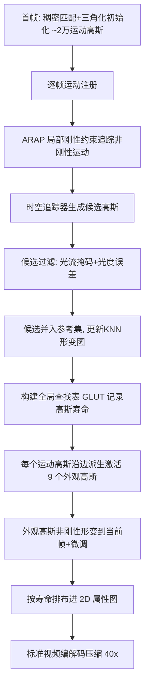

## 一句话总结

TaoGS 提出一种拓扑感知的动态高斯表示，用稀疏的"运动高斯"承担长程追踪与拓扑自适应、用可激活的"外观高斯"承担细节纹理，从而在换衣、人物-物体交互等拓扑剧变场景下同时实现鲁棒追踪、高保真渲染，并借助全局查找表把结果压进标准视频编解码格式，压缩比可达 40 倍。

## 研究背景

体积视频（volumetric video）是数字化动态物理世界的关键媒介，能提供六自由度的沉浸式体验。当前主流建模范式有两类：

- 时间条件编码类方法把随时间变化的外观编码进统一表示，渲染质量高，但只能处理短程运动，且往往生成大量高斯、存储代价高。
- 追踪类方法强调时序一致的追踪，但依赖强正则约束（如固定拓扑模板），难以应对拓扑变化。

现实场景里普遍存在拓扑变化（如脱下外套）和频繁的人物-物体交互，无法简化为固定拓扑或纯人体假设。近期工作 GauSTAR 试图用深度输入加传统曲面重网格化来解决，但会产生过度平滑的纹理，且训练成本与显存开销都很高。因此，如何在拓扑变化下同时做到长程追踪、高保真渲染，并且训练与存储都高效，仍是一个未被有效解决的核心难题。

## 方法

### 整体框架

TaoGS 的核心是一个"运动到外观"（motion-to-appearance）的解耦高斯表示，分两大部分：

1. 拓扑感知的运动注册：用约 2 万个稀疏运动高斯配合局部刚性正则捕捉场景动态，再借助时空追踪器自适应插入候选高斯，处理新出现或消失的观测，并更新局部形变图。
2. 可激活的外观高斯：每个运动高斯作为锚点派生并激活 $$K$$ 个外观高斯来表达细粒度纹理，这些外观高斯被非刚性形变到当前帧提供强初始化，并压进 2D 属性图以便视频编解码压缩。

### 关键设计

无网格初始化：不依赖 SfM 或网格（易漏掉头发、刀刃等细结构），而是把相机分成近邻对，用预训练稠密匹配器提取逐像素对应并三角化得到点云，再按不透明度剪枝，保留约 20000 个高斯。初始化损失为

$$E_{init} = \lambda_{lap}E_{lap} + \lambda_{iso}E_{iso} + \lambda_{size}E_{size} + E_{color}$$

其中拉普拉斯平滑项 $$E_{lap}$$ 促成分布规整、近似零水平集的表面。

长程追踪：把每个高斯连到其 KNN 构成形变图，用 as-rigid-as-possible（ARAP）约束同时正则化位置 $$p$$ 与旋转 $$q$$：

$$E_{smooth} = \sum_{i}\sum_{k\in N(i)} w_{i,k}^{t-1} \lVert R(q_{i,t}\ast q_{i,t-1}^{-1})(p_{k,t-1}-p_{i,t-1}) - (p_{k,t}-p_{i,t}) \rVert_2^2$$

满足此类物理约束的高斯称为运动高斯，总优化目标为 $$E = \lambda_{smooth}E_{smooth} + E_{color}$$。

拓扑变化检测与候选过滤：运动高斯本身无法处理拓扑变化。方法用时空追踪器（CoTracker）估计逐像素光流，得到 warp 场 $$W$$ 和二值掩码 $$M$$（0 表示新出现、无对应的像素），据此过滤候选高斯：

$$w_1(G_{cand}^{k}) = (1 - M_{t\to t-1}^{v_1}(u_1)) \times (1 - M_{t\to t-1}^{v_2}(u_2))$$

只保留 $$w_1 = 1$$ 的候选。但光流缺失时无法区分遮挡与真正新观测，故再引入光度误差作为辅助过滤，$$w_2(G_{cand}^{k}) = E_{color}^{v_1}(u_1) + E_{color}^{v_2}(u_2)$$，当置信度低于阈值 $$\epsilon$$（取 0.46）时丢弃。存活候选与参考集联合优化，并周期性更新局部图以防漂移。

可激活外观高斯与边初始化：稀疏运动高斯不足以高保真渲染，因此每个运动高斯沿其 KNN 图的 $$K$$ 条出边各采样一个外观高斯（实现中每个运动高斯创建激活 9 个）。外观高斯位置沿边偏向锚点约 1/3 到 1/2 处，尺度由到锚点距离决定，旋转、颜色、不透明度直接继承。运动高斯插入时激活外观高斯、剪枝时停用，把拓扑自适应的复杂度从外观层转移到运动层。

寿命感知压缩：全局查找表（GLUT）给每个运动高斯唯一索引并记录寿命，映射到 2D 布局。按寿命把高斯分为持久型与瞬态型：持久型用 Morton 编码交织空间坐标二进制位构造 2D 网格，保留空间局部性以利于帧内预测；瞬态型按激活时间戳行主序排布，利于帧间预测。最终把 2D 属性图作为图像序列用现成视频编解码器（H.264）编码，在复杂拓扑变化下仍达 40 倍压缩。

## 实验结果

在自建数据集（30 FPS、81 相机视角、4K 分辨率，含拔剑、叠杯、魔术变换等拓扑剧变序列）上，取三段 200 帧序列做定量评测。渲染质量对比如下：

| Method | PSNR ↑ | SSIM ↑ | LPIPS ↓ |
| --- | --- | --- | --- |
| 4DGS | 30.654 | 0.9644 | 0.0536 |
| Spacetime Gaussian | 34.079 | 0.9834 | 0.0256 |
| DualGS | 34.092 | 0.9800 | 0.0383 |
| HiFi4G | 34.870 | 0.9845 | 0.0246 |
| V3 | 35.043 | 0.9859 | 0.0296 |
| Ours (Before Compression) | 37.264 | 0.9911 | 0.0182 |
| Ours (After Compression) | 36.697 | 0.9881 | 0.0214 |

在性能方面，TaoGS 每帧仅需 1.335 MB 存储（压缩后）、训练约 108 s/帧（RTX 4090，约 2 分钟/帧）、渲染可达 65 FPS，且达 40 倍压缩比。消融显示 EDGS 初始化优于均匀采样和 SfM，外观高斯 9 倍（沿边）优于 4 倍设置。

## 亮点与局限

亮点：

- 运动/外观解耦，用稀疏运动高斯做长程追踪与拓扑控制、用可激活外观高斯补细节，既减冗余又加速训练。
- 时空追踪器加光度误差的双重候选过滤，能可靠区分"新观测"与"遮挡"，避免误插入冗余高斯。
- 通过 GLUT 与寿命感知的 2D 布局，天然对齐标准视频编解码格式，即使拓扑变化仍达 40 倍压缩，可在移动端和 VR 上实时播放。

局限：

- 压缩前存储高达 52.76 MB/帧，收益依赖后续视频编解码；追踪与渲染质量依赖预训练稠密匹配器和光流追踪器的准确性。
- 依赖 81 视角、4K 的密集多视角采集与逐帧优化，对单目或稀疏视角场景的适用性未验证；评测主要在自建人物中心数据集上。

## 延伸思考

把"拓扑变化"这一难题从表示层拆解为"运动层管控拓扑、外观层只管细节"，是很有启发的解耦思路——它让高频纹理建模不必反复处理结构增删。值得进一步思考的是：候选过滤阈值 $$\epsilon$$ 与激活数 $$K$$ 目前是经验设定，能否随场景自适应？另外，寿命感知的 2D 布局本质是把 4D 结构"摊平"进视频编解码器擅长的先验，这种"借力成熟编解码"的思路或许能推广到更一般的动态场景与更极端的人物-物体交互中。
