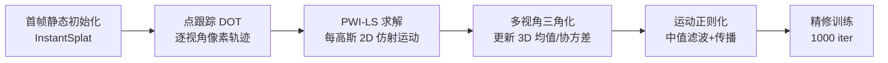

## 一句话总结

TrackerSplat 用现成的点跟踪模型估计像素轨迹，在训练之前就把 3D 高斯"搬"到下一帧的正确位置，从而在大位移快速运动下稳定重建动态场景，并让相邻帧可以跨多 GPU 并行处理、显著提升重建吞吐。

## 研究背景

- 领域现状：3D Gaussian Splatting（3DGS）以其高效、逼真的表达能力成为三维重建主流；后续工作把它扩展到动态场景，通常靠"逐帧微调"（frame-to-frame adaptation）在相邻帧之间迭代优化高斯参数来保持时序一致。
- 核心痛点：逐帧微调依赖比较高斯颜色与其覆盖像素得到的**位置梯度**来驱动运动，而梯度计算受限于一个局部邻域。当物体在帧间位移过大、移出这个邻域时，位置梯度就无法对齐真实运动，导致高斯"褪色消失"（fading）或"错误重着色"（recoloring）。在多 GPU 并行时，每台设备分到的帧间隔更大，位移问题被进一步放大。
- 本文 idea：与其只靠梯度更新位置，不如**直接估计高斯的跨帧轨迹**。利用点跟踪给出的鲁棒像素级运动，在训练前先把高斯移动、旋转、缩放到接近正确的位置，把大位移问题化解掉；由此相邻帧之间不再强耦合，可以独立并行处理。

## 方法

### 整体框架

TrackerSplat 把动态重建拆成四个阶段：先用静态重建方法（InstantSplat）初始化第一帧的 3D 高斯；对后续每一帧用点跟踪模型（DOT）提取每个像素的 2D 轨迹；再做**运动补偿**——在 2D 图像平面上求解每个高斯的仿射运动，经多视角三角化恢复 3D 位置/协方差，并用运动正则化抑制误差；最后用输入帧做少量训练**精修**。由于点跟踪解除了帧间大间隔的约束，点跟踪、运动补偿、精修三个阶段都能跨多 GPU 并行。

### 关键设计

1. **把 2D 像素轨迹翻译成高斯运动（PWI-LS）**：作者把一个 2D 高斯在两帧间的运动定义为仿射变换 $$[A \mid \boldsymbol{b}]$$，满足 $$G(\boldsymbol{x}) = G'(A\boldsymbol{x}+\boldsymbol{b})$$，据此更新 2D 均值与协方差 $$\boldsymbol{\mu}'_{2D} = A\boldsymbol{\mu}_{2D}+\boldsymbol{b}$$、$$\Sigma'_{2D} = A\Sigma_{2D}A^{\top}$$。对每个高斯覆盖的像素对，用最小二乘拟合出最佳 $$[A \mid \boldsymbol{b}]$$。为什么要做成"并行加权增量"：直接对每个高斯构造并求逆大矩阵太贵，作者利用 $$X^{\top}X$$、$$X^{\top}Y$$ 的可加结构把它分解成逐像素贡献，在渲染过程中用原子加累积到每个高斯的 $$V_1$$（3×3）、$$V_2$$（3×2），最后一次解出运动，天然适配 GPU 并行。

2. **透明度加权，抑制边界串扰**：物体边界处前景/背景高斯重叠，直接拟合会被"不属于该运动"的像素带偏。作者给每个像素赋权 $$w_i = \alpha_i T_i$$（alpha 混合中的不透明度与透射率），让低不透明度的边界像素贡献更小，减少来自重叠区域的错误运动。

3. **多视角三角化恢复 3D 参数**：拿到各视角的 2D 运动后，3D 均值 $$\boldsymbol{\mu}'_{3D}$$ 通过多视角三角化（SVD 求解，至少两视角）恢复；3D 协方差 $$\Sigma'_{3D}$$ 由各视角 $$\Sigma'_{2D} = JW\Sigma'_{3D}W^{\top}J^{\top}$$ 组成的线性方程组求解，再对其做特征分解得到旋转与缩放。这里有两个坑：负特征值不能开方（直接丢弃），以及特征值默认按大小排序会打乱帧间旋转/缩放的对应顺序（重排特征值与特征向量，使其量级顺序与首帧一致），否则会造成运动传播的不稳定。

4. **运动正则化 + 精修**：点跟踪与部分观测会引入离群高斯或错误运动，类似图像里的椒盐噪声。作者对每个高斯的参数差分（$$\Delta\boldsymbol{\mu}_{3D}$$、$$\Delta R$$、$$\Delta S$$）在 K 近邻上做中值滤波平滑；对因可见性低或负特征值等原因无法可靠求解的高斯，用邻居运动做传播，并先甄别出静态高斯（覆盖像素在至少 2 个视角中 90% 以上保持不动）不参与传播。最后用输入帧训练 1000 步精修——由于高斯已被移动到近似正确位置，训练又快又稳。

## 实验结果

在多个真实动态场景数据集上评测。下表为短片段实验（不同并行度）中各方法的平均视觉质量（取部分代表场景，PSNR↑ / SSIM↑ / LPIPS↓），核心结论是：随着并行度从 1 GPU 增到 8 GPU（帧间隔变大），基线在快速运动场景明显掉质量，而 TrackerSplat 保持稳定。

| 场景 / 方法（8 GPU） | PSNR↑ | SSIM↑ | LPIPS↓ |
|------|-------|-------|--------|
| basketball · P. Dy.3DGS | 27.7 | .915 | .117 |
| basketball · P. HiCoM | 29.6 | .928 | .102 |
| basketball · Ours | 31.9 | .944 | .076 |
| juggle · P. Dy.3DGS | 29.7 | .938 | .082 |
| juggle · Ours | 32.5 | .954 | .062 |
| boxes · P. HiCoM | 31.0 | .943 | .074 |
| boxes · Ours | 31.9 | .951 | .064 |

可见在 8 GPU 高并行度下，"basketball"这类快速运动场景基线（如 Parallel Dynamic3DGS）PSNR 掉到 27.7，而本文仍有 31.9；在慢速运动场景（如"coffee martini"）各方法差异很小（约 0.1 PSNR），本文与基线相当。吞吐方面（每帧秒数），本文在多数数据集/并行度下取得最高吞吐，因为省去了复杂正则化或形变场；但在视角多（27 视角）、分辨率低的 Dynamic3DGS 数据集上，点跟踪开销超过了简化训练带来的收益，吞吐反而略低于基线。

## 亮点与局限

- 亮点：
  - 首次指出 3DGS 在大帧间位移下的鲁棒性缺陷，并首次用**多视角点跟踪直接计算高斯轨迹**来解决，思路清晰、切中要害。
  - "先移动到正确位置再训练"把帧间强耦合打破，使相邻帧可独立并行，在不增加端到端延迟的前提下提升吞吐，工程价值明显。
  - PWI-LS 通过增量+加权+GPU 并行三步，把逐高斯最小二乘做得高效且抗边界串扰；多视角三角化 + 中值滤波 + 传播多重机制层层纠错，对点跟踪误差有较好鲁棒性。

- 局限：
  - 小/细物体（如手指）点跟踪易漏掉细微运动，导致模糊或细节缺失。
  - 存在时序抖动（jitter），来自低纹理区的跟踪歧义与 3DGS 表达本身的时空不一致。
  - 误差会累积：精修不足以完全纠正早期帧的错误，首帧误差可能传播到后续帧，尤其在训练视角有限或复杂场景下。
  - 遮挡问题：点跟踪以首帧像素为匹配基准，若物体在首帧被完全遮挡、后续才出现，则可能无法正确估计轨迹，造成重建缺失。

## 延伸思考

- 该方法本质是"用外部先验（点跟踪）给几何优化一个好的初始化"，与近年"先对齐再优化"的思路一脉相承；把 2D 视频先验注入 3D/4D 表达，是当前动态重建的一条主线。
- 作者提出的潜在改进值得关注：结合动态增删高斯（对褪色高斯移除、在高梯度区新增）来补足遮挡/新出现物体，但这需要额外机制把新增高斯匹配到已有轨迹；以及把面向时空一致性的 3DGS 误差分解引入精修阶段。
- 吞吐在多视角低分辨率数据集上不占优，提示点跟踪本身的成本在视角数增多时会成为瓶颈——如何让跟踪阶段也随视角高效扩展，或复用跨视角的跟踪结果，是实用化的一个值得追问的点。
