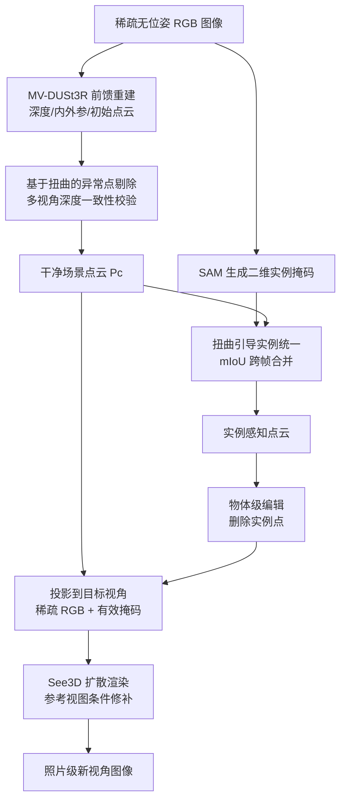

## 一句话总结

提出一套完全免训练、无需相机位姿的统一流水线，从稀疏无位姿 RGB 图像重建出干净、带实例语义的三维点云，并借助三维感知扩散模型直接渲染出照片级新视角图像，同时天然支持物体级场景编辑。

## 研究背景

从少量二维图像重建三维场景并渲染或编辑，是创意设计、影视、游戏、VR/AR 等领域的基础工作流。以 NeRF、3DGS 为代表的辐射场方法能在图像足够密集时得到高保真结果，但它们依赖逐场景优化和大量输入，在稀疏、无位姿的随手拍摄场景下难以维持重建质量，也难以直接支持交互式编辑。此外，多数方法无法在不额外微调的情况下做到物体实例级别的结构化操作。

作者指出，一个"免训练、可处理稀疏视角、同时具备高保真渲染与语义理解能力"的系统此前基本缺失。因此本文的目标是：给定 10 到 20 张室内场景的稀疏无位姿图像，重建带清晰实例分割的三维表示，并从任意视角合成新视图。核心挑战有三点——从稀疏无位姿输入稳健重建几何、生成实例级语义理解、以及从三维内容渲染出视觉连贯的照片级图像。

## 方法

整体框架由三个相互衔接的模块组成：几何重建、实例感知、新视角渲染。首先用前馈模型（MV-DUSt3R）从无位姿图像直接预测逐像素对齐的稠密点云，并用基于深度扭曲一致性的异常点剔除策略去除不可靠点；随后用扭曲引导的二维到三维实例统一策略跨帧对齐分割掩码，得到实例分割点云；最后把点云投影到目标视角，用三维感知扩散模型 See3D 修补缺失区域并细化纹理，得到照片级渲染。整个流程无需任何位姿预处理或逐场景训练。

关键设计：

- **基于扭曲的异常点剔除**：对每个点在其它视角下计算扭曲深度 $$W_i^j(u,v)$$，若其明显小于该视角原生深度即 $$W_i^j(u,v) < \tau \cdot Z_j(u,v)$$（实验中 $$\tau = 3/4$$），说明该点浮在真实表面之前，判为异常并跨所有视角对进行一致性校验，聚合通过校验的点得到干净点云。
- **扭曲引导的实例统一**：先用 SAM 类模型（实现中用轻量的 MobileSAMv2）得到每帧掩码并回溯为三维点组，再把点组投影到另一视角得到投影掩码，与该视角掩码计算掩码交并比，当 $$\mathrm{mIoU}(S'^{j}_{k}, S^{j}_{l}) > \eta$$（实验中 $$\eta = 1/3$$）时判定为同一实例并合并，直至不再有可合并项，从而获得跨视角一致的实例点组。相比依赖时序跟踪（如 SAM2）的 PE3R，几何一致性对齐在稀疏房间尺度场景下更稳。
- **点云扩散渲染与编辑一致性**：把点云投影为稀疏 RGB 图 $$\hat{I}_k$$ 及有效像素掩码 $$M_k$$，连同参考输入视图交给 See3D 得到补全图 $$\tilde{I}_k = M(\hat{I}_k, M_k, \lbrace I_i \rbrace_{i=1}^{n})$$。做物体删除等编辑时，用参考掩码策略把被删内容在各输入图上的投影区域置零，避免过时参考引入矛盾，保证编辑后视图几何一致。

## 实验结果

在 ScanNet++/ScanNet 稀疏视角测试场景上评估新视角合成质量（PSNR / SSIM / LPIPS），并标注各方法是否需要相机位姿输入与逐场景训练。本文方法在完全免位姿、免训练的前提下取得最优结果：

| 方法 | 免位姿 | 免训练 | PSNR ↑ | SSIM ↑ | LPIPS ↓ |
| --- | --- | --- | --- | --- | --- |
| 3DGS | 否 | 否 | 15.61 | 0.602 | 0.541 |
| 2DGS | 否 | 否 | 15.55 | 0.591 | 0.544 |
| GaussianGrouping | 否 | 否 | 15.72 | 0.610 | 0.532 |
| DNGaussian | 否 | 否 | 16.82 | 0.627 | 0.549 |
| CoR-GS | 否 | 否 | 17.12 | 0.631 | 0.496 |
| SE-GS | 否 | 否 | 17.03 | 0.635 | 0.502 |
| LVSM | 否 | 是 | 12.92 | 0.617 | 0.620 |
| PE3R + 本文渲染 | 是 | 是 | 14.68 | 0.560 | 0.529 |
| MV-DUSt3R+ + 本文渲染 | 是 | 是 | 17.69 | 0.613 | 0.458 |
| 本文 | 是 | 是 | 18.15 | 0.645 | 0.434 |

此外：实例分割上本文 AP 达 25.0，优于 PE3R（20.2）与 DEVA（13.9）；深度评估 RMSE 0.209、$$\delta < 1.25$$ 为 0.981，略优于 MV-DUSt3R+；运行时间上，在 20 张输入 + 10 张测试的设定下总耗时约 3.5 分钟（重建约 1 分钟、推理约 2.5 分钟、无需位姿处理），远低于 NeRF 的 149.5 分钟与 3DGS 的 9 分钟。消融显示扭曲实例统一使 AP50 提升约 15 点，异常点剔除与参考掩码也分别改善了重建与编辑渲染质量。

## 亮点与局限

亮点：

- 完全免训练、免位姿的统一流水线，把稀疏图像一步打通到"重建—感知—渲染—编辑"，部署门槛低、整体耗时短。
- 用几何扭曲一致性替代时序跟踪来做二维到三维实例统一，在稀疏房间尺度场景下实例一致性更强。
- 首次为"点云直接渲染"这一范式配上三维感知扩散渲染管线，弥补点云稀疏离散导致的空洞，并让物体删除等编辑只需改点云即可得到一致的编辑视图。

局限：

- 扩散渲染尚不能实时，仅适合离线或对质量要求高的交互场景。
- 整体性能依赖 MV-DUSt3R、SAM、See3D 等现成模型，重建、分割与生成质量受这些外部模块上限约束。
- 评测主要在室内 ScanNet/ScanNet++ 场景，编辑演示以物体删除这一概念验证为主，更复杂的编辑操作与室外/大范围场景尚待验证。

## 延伸思考

这项工作体现了一条"组合现成基础模型 + 轻量几何一致性规则"的免训练路线：不追求端到端重新训练，而是把前馈重建、二维分割基础模型与三维感知扩散渲染拼接起来，用简单的深度扭曲一致性和 mIoU 匹配把它们对齐。这种范式的价值在于快速、可移植、易维护，但天花板也被上游模型锁定。

一个自然的延伸是把点云作为可编辑中间表示的潜力做深：既然删除实例只需删点，那么移动、复制、替换、材质编辑等操作是否也能靠点云层面的局部更新加参考掩码策略统一支持？此外，扩散渲染的多视角一致性与实时性是关键瓶颈，若能引入一致性约束或蒸馏加速，或将该管线从离线工具推向交互式三维内容创作。
