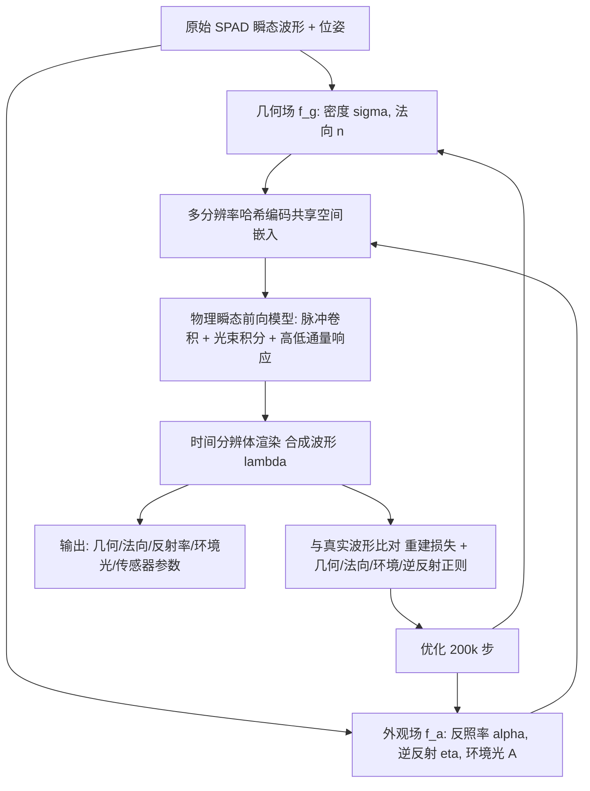

## 一句话总结

提出 Transient LASSO——首个直接以车规级 SPAD LiDAR 的原始瞬态波形(raw transient waveform)为监督信号的神经场景重建方法，通过一套显式的物理成像模型把户外真实道路场景分解为几何(占用与法向)、材质(反射率)、环境光与传感器硬件参数，从而在最远约 200 米的大尺度户外场景上实现高保真几何与外观重建，并支持新视角波形合成、超分与传感器参数优化等下游应用。

## 研究背景

大尺度户外场景的几何与外观重建是自动驾驶与无人机的关键任务。基于辐射场(NeRF 类)的方法最初用于 RGB 新视角合成，后被扩展到 LiDAR、雷达、近红外等模态。针对户外重建，LiDAR 因其显式距离信息与高时间分辨率被广泛采用，但已有神经场方法存在两大问题：

- 它们操作于 LiDAR 数字信号处理器(DSP)已抽取、预处理后的点云，而非传感器捕获的原始瞬态波形(时间分辨的回波强度)。这会把峰值检测算法的误差(漏检、测距错误、多回波伪影)一并传递下去。
- 无法为已见或未见视角重建原始波形，限制了其在重仿真中的用途，也无法服务任何依赖原始波形的算法。

另一条平行路线把神经重建扩展到瞬态波形，通常用原型单光子 LiDAR 采集(如 TransientNeRF、Transientangelo、Flying with Photons)。它们能重建原始波形，但只在理想的实验室级、近距离室内条件下验证过。真实户外大场景中，复杂环境光与高光子通量(high-flux)条件会严重扭曲 LiDAR 测量，导致明显伪影。

本文要弥合这一空白：让瞬态波形重建能在真实户外"野外"(in-the-wild)大场景中工作。核心难点是要在成像模型里同时刻画环境光干扰、长距离光束发散(beam divergence)以及高通量条件下 SPAD 的畸变响应。

## 方法

### 整体框架

系统用带 2D SPAD 阵列的 LiDAR，通过时间相关单光子计数(TCSPC)采集波形直方图(每帧 $$40\times128$$ 个波形，每个波形 $$M=2112$$ 个时间 bin)。方法把场景表示为神经场 $$f:\{\mathbf{x}\}\to\{\sigma,\mathbf{n},\alpha,\eta,A\}$$，将空间点映射到体密度、法向、漫反射反照率、逆反射(retroreflectivity)与环境光；再用一套物理成像前向模型把这些场经时间分辨的体渲染合成为波形，用真实采集波形做监督并反向优化。

### 关键设计 1：物理驱动的瞬态成像前向模型

从光子通量出发建模到达表面元的入射通量 $$\psi_q(t)=\int_{\mathcal{T}} g(t-\tau)H_q(\tau)\,d\tau + a_q(t)$$，其中 $$g$$ 为激光脉冲形状、$$H_q$$ 为场景瞬态响应、$$a_q$$ 为环境光贡献。单点响应写成 $$H_q(t)=\frac{\rho\,(\mathbf{n}\cdot\boldsymbol{\omega}_q)}{d^2}\,\delta\!\left(t-\frac{2d}{c}\right)$$，反射率 $$\rho$$ 拆成漫反射 $$\alpha$$ 与镜面/逆反射分量 $$\eta$$，环境项写作 $$a=\alpha A$$。为刻画长距离光束发散，用空间高斯光束轮廓 $$K$$ 对像素表面做 2D 积分(实现为带步长的 2D 卷积)，使波形可呈多峰。

### 关键设计 2：高通量(high-flux)与低通量分别建模

低通量下用逐 bin 独立的泊松分布 $$\zeta^L_p[k]=\mathrm{Poisson}(\lambda_p[k])$$，可把观测直接作为无偏监督。但户外交通标志等逆反射材料频繁触发高通量，此时 SPAD 因死区(dead time)出现严重的"堆积(pile-up)"畸变、峰值前移。作者用一个畸变核 $$h(t;\Theta)$$ 近似高通量响应，并按估计通量是否超阈值 $$B_T$$ 切换低/高通量重建：$$\hat{\lambda}^T_p=\hat{\lambda}^L_p$$(全程低于阈值)或 $$\hat{\lambda}^H_p=(\hat{h}*w)+A_p$$(否则)。脉冲核 $$\hat{g}$$ 与畸变核 $$\hat{h}$$ 均可优化，用以补偿标定不准与制造差异。

### 关键设计 3：隐式场表示与可优化传感器内参

用两个多头神经场：几何场 $$f_g$$ 输出密度与法向，外观场 $$f_a$$ 输出反照率、逆反射与环境光，二者经多分辨率哈希编码共享空间嵌入 $$\chi$$，并用 proposal 采样器加速。射线建模为 $$\mathbf{x}_\tau=\mathbf{o}_p+c\tau(\boldsymbol{\omega}_q+\vartheta_p)$$，其中每个像素的偏移 $$\vartheta_p$$ 初始化为零并可学习，用于校正扫描机构的光学/机械系统性畸变。体渲染采用平方透过率 $$T^2(\tau)$$ 同时计入入射与返回两段光程。这种"场景参数与传感器硬件参数解耦"是其支持下游传感器/DSP 参数优化的关键。

### 关键设计 4：多项监督与正则

总损失 $$\mathcal{L}=\upsilon_1\mathcal{L}_b+\upsilon_2\mathcal{L}_g+\upsilon_3\mathcal{L}_n+\upsilon_4\mathcal{L}_a+\upsilon_5\mathcal{L}_h$$ 包含：波形重建损失 $$\mathcal{L}_b$$(对高/低通量分量分别加权 $$L_2$$)、由瞬态抽取的伪真值深度/法向监督 $$\mathcal{L}_g$$、法向一致性与背向惩罚 $$\mathcal{L}_n$$、鼓励高通量表面具高镜面分量的逆反射损失 $$\mathcal{L}_h$$、以及使环境光局部平滑的一致性损失 $$\mathcal{L}_a$$。

## 实验结果

在自采数据集(10 段昼夜城市户外与受控场景，用 Velodyne VLS128 及 Leica 激光扫描仪产出稠密真值)上评测三维重建质量，以 Chamfer 距离(CD)、单边 CD(距离精度)与点云召回率为指标，对比 RGB、点云、瞬态三类模态的主流方法。

| 方法 | 模态 | CD [m] ↓ | 距离精度 [m] ↓ | 召回率 [%] ↑ |
|---|---|---|---|---|
| Gaussian Splatting | RGB | 2.357 | 1.018 | 35.23 |
| Mip-NeRF 360 + Marigold | RGB | 1.872 | 0.970 | 40.50 |
| LiDAR-NeRF | 点云 | 1.379 | 0.704 | 40.26 |
| NFL | 点云 | 1.827 | 0.485 | 41.35 |
| TransientNeRF | 瞬态 | 0.837 | 0.500 | 56.88 |
| Flying with Photons | 瞬态 | 0.826 | 0.493 | 56.72 |
| Ours | 瞬态 | 0.642 | 0.359 | 60.12 |

主要发现：本方法在全部指标上均优于所有对比方法。RGB 方法因驾驶轨迹视角受限与尺度歧义而难以重建；直接用原始波形相比只用抽取点云的 NFL(点云压缩率可达约 1000 倍)保留了更多信息；相比同为瞬态的方法，本方法是唯一能正确建模复杂户外场景的，得益于几何、反射率与环境光的解耦。新视角合成方面，本方法在保留视角上 PSNR 达 55.13 dB、SSIM 达 0.912，较次优的 Flying with Photons(PSNR 50.02、SSIM 0.600)高出约 10% PSNR 与约 52% SSIM；消融显示去掉环境光建模或脉冲优化都会显著降质。此外，LASSO-in-the-loop 参数优化在一处晴天场景上把峰值检测的 $$g_{\max}$$ 与 $$V_{\min}$$ 优化后，CD 由专家调参的 1.420 m 降到 1.169 m(提升约 21.47\%）。

## 亮点与局限

亮点：
- 首个直接在车规级 SPAD LiDAR 原始瞬态波形上工作、面向真实户外大场景(最远约 200 米，比现有方法大一个数量级)的神经重建方法。
- 显式物理成像模型刻画环境光干扰、长距离光束发散与高通量畸变，把测量解耦为几何、反射率、环境光与传感器硬件参数。
- 场景与硬件参数的解耦使其能对真实数据直接做基于梯度的 DSP/传感器参数优化，而不必依赖仿真环境。
- 可为未见视角合成完整波形，支持重仿真、超分等依赖原始波形的下游任务。

局限：
- 属测试时优化(test-time optimization)方法，单场景在单张 A100 上约需训练 6 小时，成本较高。
- 强依赖对传感器内参(脉冲形状、光学畸变、高通量响应)的准确建模，高通量畸变靠可学习核近似而非精确物理推导。
- 几何监督使用从瞬态抽取的伪真值深度/法向，本身含噪且只对部分像素可得。
- 评测数据集为作者自采(10 段、每段 100 帧)，规模有限且非公开标准基准。

## 延伸思考

- "原始波形 + 显式物理前向模型 + 神经场解耦"的范式，为其他时间分辨传感器(如调制 ToF、条纹相机)在户外的应用提供了可迁移的模板，关键在于把硬件畸变纳入可微前向模型。
- 把传感器参数纳入可微渲染并做端到端优化，指向"任务驱动的传感器设计与配置"这一更广命题，可能改变 LiDAR/DSP 的调参与选型流程。
- 高通量堆积畸变目前用可学习核近似，若能引入更精确的死区/堆积物理模型，或可进一步减少逆反射目标处的伪影。
- 6 小时的单场景优化是落地瓶颈，如何借助前馈/可泛化表示或高斯点等更高效表示，把瞬态重建从 test-time 优化推向近实时，是值得探索的方向。
