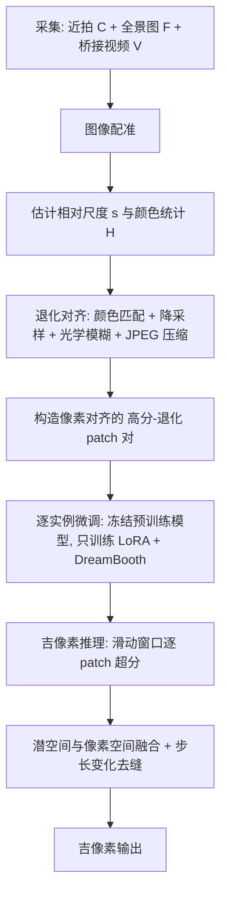

## 一句话总结

UltraZoom 只用一张普通全景照片加上几张手机微距近拍，就能把整个物体放大到吉像素（gigapixel）分辨率，让局部纹理细节既逼真又忠实于物体真实外观，支持在整件物体上无缝平移与缩放。

## 研究背景

日常相机分辨率固定，拍摄物体时必须在"覆盖全貌"和"看清细节"之间取舍。传统吉像素成像需要专用设备拍摄并拼接成千上万张高分辨率照片，代价高昂。

作者的关键观察是：单个物体不同于城市天际线那种每处都独一无二的复杂场景，它往往具有较强的自相似性，只由有限几种材质纹理构成。因此少量近拍快照就足以覆盖物体的纹理种类，从这些稀疏样本出发，有可能以合理且忠实的方式推断出整个物体缺失的精细细节。

已有方法各有短板：参考式超分（RefSR）与双摄超分通常假设参考图与输入中心对齐、尺度差异小；任意尺度超分在极端放大倍率下容易过度平滑；级联式多尺度方法难以泛化到训练范围之外，还会累积误差。UltraZoom 的设定是随手手持拍摄、普通镜头与微距镜头混用，尺度差异大、透视/颜色/噪声不一致，对齐极其困难。

## 方法

整体框架分三个阶段：数据构建、逐实例微调、吉像素推理。核心思路是"只用近拍构造像素对齐的高-低分辨率训练对，通过退化模拟让训练分布贴近推理时的全景图外观"。

关键设计：

1. **基于桥接视频的配准（Image Registration）**。近拍与全景图纹理高度重复、尺度差异大，SIFT 或学习式方法都难以直接配准。作者改用一段从近拍逐渐拉远到全景的桥接视频，用点跟踪逐帧追踪，并在每段视频上用 RANSAC 估计一个 2D 相似变换，再把各段变换链式相乘，得到从近拍帧到全景图的累计变换 $$T_{C_i \to F} = T_{V_N} \cdot (T_{V_{N-1}} \cdot (\cdots (T_{V_{i+1}} \cdot T_{V_i}) \cdots))$$。尺度 $$s$$ 从最终变换左上角 $$2\times2$$ 子矩阵取行列式的平方根得到：$$s = \sqrt{\det\left(T_{C_i \to F}[:2,:2]\right)}$$。视野变化快的片段会重新初始化跟踪点以提升鲁棒性。

2. **退化对齐（Degradation Alignment）**。为缩小训练-测试域差距，把高清近拍退化成对应全景区域的外观：先用估计变换定位近拍在全景中的对应区域，提取颜色统计并做颜色匹配得到 $$\tilde{C}_i$$；再按尺度 $$s$$ 做双三次降采样，额外 2 倍降采样模拟远距离拍摄的光学模糊；当全景区域压缩痕迹明显更重时再施加 JPEG 压缩（质量 75）。

3. **逐实例微调 + 流匹配损失**。冻结预训练生成模型权重，只优化低秩适配（LoRA）并结合 DreamBooth，最大限度利用预训练模型的高保真生成能力、同时抑制先验带来的幻觉。训练目标为流匹配损失：$$\mathcal{L}_{FM} = \mathbb{E}_{c_t,t,d}\left[\lVert \hat{u}_\theta(c_t,t,d,y) - u(c_t,t)\rVert_2^2\right]$$，其中 $$c$$ 为高清 patch，$$d$$ 为对应退化 patch，$$y$$ 为固定的逐实例文本提示。

4. **吉像素推理与步长变化去缝**。受显存限制，把全景图切成滑动窗口逐块超分；重叠潜空间区域取平均、解码后像素重叠区做融合。为消除固定接缝处累积的边界伪影，作者在去噪步骤间逐渐增大步长（stride variation），既减少沿固定缝隙的伪影累积，又降低总窗口数从而缩短推理时间。

## 实验结果

在 iPhone 16 拍摄的 15 个日常物体（尺度 6x 到 30x）上评测，对比 Thera、ContinuousSR、ZeDuSR 三个基线（均补充作者估计的尺度，ZeDuSR 另用作者的配准）。指标含低分辨率一致性 LR-MAE、以及在随机 patch 上计算的 Patch-FID / Patch-KID，另有 17 名参与者的用户研究。

| 方法 | LR-MAE ↓ | P-FID ↓ | P-KID ↓ | 用户研究质量 Top-1 ↑ | 用户研究一致性 Top-1 ↑ |
|------|----------|---------|---------|----------------------|------------------------|
| ContinuousSR | 0.038 | 310.371 | 0.350 | 0.33% | 4.58% |
| Thera | 0.007 | 327.872 | 0.391 | 1.63% | 12.09% |
| ZeDuSR | 0.051 | 348.874 | 0.404 | 1.961% | 3.92% |
| Ours | 0.040 | 134.986 | 0.130 | 96.08% | 79.41% |

本方法在 Patch-FID/KID 上大幅领先（约 135 对比基线约 300），用户研究中质量被选为最佳的比例达 96.08%、一致性达 79.41%。LR-MAE 略高于 Thera，作者解释这是因为生成了更多高频细节、缺少显式一致性约束所致，属预期现象。

## 亮点与局限

亮点：
- 输入门槛极低，仅需一部手机随手拍摄若干近拍、一张全景图和几段桥接视频，即可得到 0.25 到 5 吉像素、6x 到 30x 的可缩放成像。
- 用桥接视频+点跟踪链式配准的思路，巧妙绕开了在高度重复纹理、大尺度差下直接配准的难题，适用于任意材质的野外随手拍摄。
- 退化对齐让"只用近拍构造训练对"成为可能，配合逐实例微调有效抑制生成先验带来的幻觉，忠实还原物体真实纹理。

局限（作者明确列出）：
- **推理慢**：滑动窗口逐块生成在吉像素尺度下代价巨大，例如生成约 1.87 万见方的输出需约 2.1 万次前向、耗时约 3.82 小时。
- **逐实例微调**：每个新物体都要重新训练，效率低，理想方向是训练一个免微调的通用模型。
- **退化操作靠手工选择**：模糊、降采样、JPEG 等退化参数目前手动设定，未来可自动优化或用学习式退化模型。
- **缺乏全局上下文**：模型只在局部裁块上工作，无法感知 patch 在整体中的位置与结构，限制了物体级一致性与歧义区域的推断。

## 延伸思考

这篇工作把"超分"重新表述成了"逐实例的纹理条件生成"，核心洞见是物体的自相似性——这让稀疏近拍成为强先验，绕过了通用超分在极端倍率下的幻觉与平滑问题。它的价值不只在效果，更在于把昂贵的吉像素采集流程压缩成一次随手手机拍摄。

几个值得延伸的点：其一，作者提出的检索式推理（对相似 patch 缓存/复用生成结果）若能落地，可能是把小时级推理降到实用区间的关键；其二，"退化对齐"本质上是在手工建模域间差距，用可学习退化或域适应替代，或许能推广到更一般的跨镜头、跨设备重建；其三，注入全局上下文（位置编码、层级特征）是让局部生成走向物体级一致性的自然下一步，这与当前长程一致性生成的研究趋势相通。此外，方法对物体自相似性的依赖也划定了适用边界——面对每处都独特的复杂场景，稀疏近拍的先验会失效。
