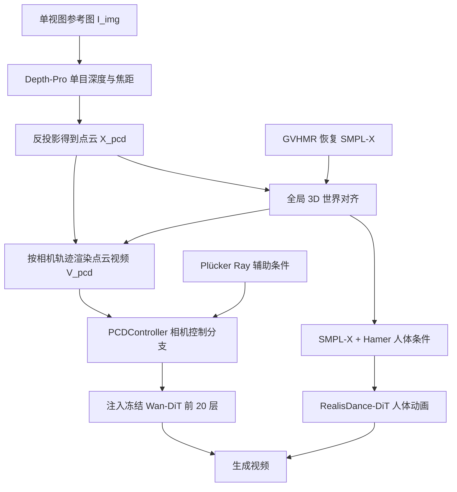

## 一句话总结

Uni3C 提出一个 3D 增强的统一框架，在冻结的大型视频扩散模型之上，用轻量的点云相机控制模块与推理阶段的全局 3D 世界对齐，实现相机轨迹与人体动作的精确联合控制，且无需两类条件的联合标注数据。

## 研究背景

可控视频生成是当前视频扩散模型（VDM）的重要方向，其中相机控制与人体动作控制都各自被广泛研究，但通常被分开处理，面临三个核心难题：

- 多数方法深度改动 VDM 的内在能力，依赖领域特定数据与条件，难以泛化到分布外场景。
- 极少有工作研究相机轨迹与人体动作的联合控制，因为同时具备两类高质量标注的以人为中心视频数据十分昂贵。
- 缺乏融入 3D 先验、且能同步控制相机与人体动作的显式引导；仅依赖点云与 SMPL 等分离条件，难以表达角色与环境之间物理合理的交互与位置关系，容易产生冲突引导。

作者提出：对强大的基础 VDM，只需轻量可训练模块加上充分的 3D 信息引导即可实现相机控制；同时相机与人体动作本质上相互依赖，应在推理阶段把二者对齐到统一的全局 3D 世界中。

## 方法

### 整体框架

Uni3C 构建在基础视频扩散模型 Wan2.1（14B 参数）之上，包含两大组件：

- **PCDController**：即插即用的相机控制模块（仅 0.95B 参数），基于单目深度反投影得到的点云进行渲染，作为控制分支注入冻结的 Wan-DiT 主干。它可以在冻结主干上训练，也能兼容微调后的主干（如用于人体动画的 RealisDance-DiT）。
- **全局 3D 世界引导（Global 3D World Guidance）**：在推理阶段把场景点云（相机控制）与 SMPL-X 角色（人体动画）对齐到同一世界坐标系，统一两类控制信号。

### 关键设计

1. **轻量化的相机控制模块**。参照 AC3D，PCDController 采用从零训练的简化 DiT，而非复制主干权重的 ControlNet 式设计。隐藏维度从 5120 降到 1024，通过零初始化线性层投回 5120 再加到 Wan-I2V；只把相机特征注入 Wan-I2V 的前 20 层（VDM 主要通过浅层决定相机信息）；并丢弃文本条件、移除全部交叉注意力以缓解幻觉，最终可训练参数压缩到 0.95B。

2. **点云 3D 几何先验**。用 Depth-Pro 提取参考视图的单目深度，借助 SfM 标注或多视立体对齐为度量深度，再用 RANSAC 求重缩放与偏移系数以防止深度塌缩。随后将 2D 像素反投影到世界坐标得到点云，反投影关系为 $$X_{pcd}(x) \simeq R_{c \to w}\, \hat{D}_{img}(x)\, K^{-1}\, \hat{x}$$，其中 $$K, R_{c \to w}$$ 分别是参考视图的内参与外参。按目标相机用 PyTorch3D 渲染出点云视频 $$V_{pcd}$$（首帧对应参考图以保证身份一致），经 3D-VAE 编码为点latent 条件；同时用小型相机编码器编码 Plücker ray 作为辅助条件，以应对超出首帧点云可见范围的大视角变化。

3. **人体动画分支**。以并行工作 RealisDance-DiT 为例，它在推理时直接替换 Wan-I2V 主干，通过新增的零初始化层引入 SMPL-X 与 Hamer 条件引导人体动作，只训练自注意力与 patchify 编码器以保泛化；相机控制特征则由外部的 PCDController 叠加进来，实现无联合微调的组合。

4. **全局 3D 世界对齐**。点云处于环境世界空间 $$W_{env}$$，SMPL-X 处于人体世界空间 $$W_{hum}$$。用 ViTPose++ 从参考图估计 17 个 2D 关键点并反投影到 $$W_{env}$$ 得到 3D 关键点，用 COCO17 回归器把 SMPL-X 投影到同名关键点，再用 Umeyama 最小二乘刚体变换对齐：$$\min_{\tilde{s}, \tilde{R}, \tilde{t}} \sum_{i=1}^{17} w_i \lVert (\tilde{s}\tilde{R}(k^i_{hum})^T + \tilde{t})^T - k^i_{env} \rVert^2$$，其中 $$w_i$$ 为关键点置信度（低于 0.7 者丢弃）。再用 GeoCalib 估计 $$W_{env}$$ 的重力方向对 SMPL-X 做重力校准，避免动作"升天入地"；Hamer 通过与 SMPL-X 手部共享顶点同样对齐，并按渲染深度屏蔽被遮挡手部。

## 实验结果

在分布外相机控制基准（32 张跨域图像、每张 4 条轨迹，共 128 个测试样本）上，用 VBench++ 评估视频质量，用 ATE、RPE、RRE 评估相机精度（下表为部分关键结果，粗体行为 PCDController 最终设定；† 表示挑战性 360° 旋转）：

| 方法 | Plücker | Pcd | Overall↑ | Imaging↑ | ATE↓ | RPE↓ | RRE↓ |
|------|---------|-----|----------|----------|------|------|------|
| MotionCtrl | | | 82.48 | 55.02 | 0.345 | 0.263 | 2.547 |
| CameraCtrl | ✓ | | 83.69 | 54.13 | 0.354 | 0.239 | 2.306 |
| CamI2V | ✓ | | 86.52 | 66.22 | 0.322 | 0.247 | 1.653 |
| ViewCrafter | | ✓ | 85.39 | 64.33 | 0.210 | 0.117 | 0.873 |
| SEVA | | ✓ | 87.39 | 68.43 | 0.077 | 0.029 | 0.223 |
| Ours (Wan-I2V) | ✓ | | 89.16 | 72.20 | 0.402 | 0.095 | 0.728 |
| **Ours (Wan-I2V)** | | ✓ | 87.95 | 71.12 | 0.091 | 0.028 | 0.211 |
| **Ours (Wan-I2V)** | ✓ | ✓ | 88.27 | 71.96 | 0.102 | 0.031 | 0.246 |
| Ours (Wan-I2V)† | | ✓ | 82.70 | 66.95 | 1.327 | 0.551 | 6.334 |
| Ours (Wan-I2V)† | ✓ | ✓ | 82.82 | 66.25 | 1.010 | 0.416 | 4.428 |

结论包括：点云条件显著提升 Wan2.1 与 CogVideoX 的相机可控性（ATE/RPE/RRE 大幅下降）；仅用 Plücker ray 的基线虽 VBench 分高但相机精度差；SEVA 虽精度高，但需要 0.8M 迭代的大量静态多视图训练，难以处理含人体、动物的动态分布外场景。在 500 样本的大基准（megascenes 与网络人体场景）上，PCDController 取得最高 Overall（86.62）与领先的 RPE/RRE。在统一控制基准（50 段 720p 视频、每段 3 类轨迹，共 150 例）上，Uni3C 相较 CamAnimate、RealisDance-DiT 等在 VBench 分数与相机精度间取得更好平衡，并揭示对齐后的 SMPL-X 能进一步增强相机可控性、I2V 训练的 PCDController 也能提升人体动画的视觉一致性，二者互补。

## 亮点与局限

亮点：

- 用仅 0.95B 参数的即插即用模块，在冻结 14B 主干上实现精确相机控制，避免"魔改"基础模型能力，从而保住泛化。
- 相机模块可跨冻结/微调主干复用，支持相机与人体动作模块各自在专属领域独立训练，摆脱对联合标注数据的依赖。
- 推理阶段的全局 3D 世界对齐把点云与 SMPL-X 统一到同一坐标系，支持涉及不同角色、位置、视角的复杂运动迁移，并用重力校准保证物理合理性。
- 提出了针对挑战性相机运动与人体动作的新基准与数据集。

局限：

- 点云来自单目深度反投影，仍是不完美的；虽然论文显示对不完美点云有鲁棒性，但极端视角变化下（如 360° 旋转）各项指标明显退化。
- 人体点云在世界空间中静止不动，与 SMPL-X 提供的运动条件存在冲突；实验显示屏蔽人体点云虽略提升视觉质量，却损害相机精度（尤其人体占画面比例大时）。
- 用 Plücker ray 单独驱动大型 VDM 收敛困难，作者也指出增加可训练参数可能改善但会损害泛化，未在本工作中探索。
- 依赖 Depth-Pro、GVHMR、GeoCalib、ViTPose++、VGGT 等一系列外部估计模型，链路较长，误差可能累积。

## 延伸思考

- "少训练、强引导"的思路值得推广：对已具备强能力的基础模型，与其大改主干，不如注入高信息量的结构化条件（如点云）并只训练极小模块，这既降低成本又保护泛化，可能适用于更多可控生成任务。
- 把不同模态条件对齐到统一 3D 世界坐标，是解耦控制的关键。这种"先对齐到共同空间、再重新渲染条件"的范式，或可扩展到物体、光照、多角色等更多可控要素的联合生成。
- 依赖多个现成估计器带来的误差累积与实时性问题，是走向实用的主要障碍；未来可探索端到端联合估计或更鲁棒的对齐机制来缩短链路。
