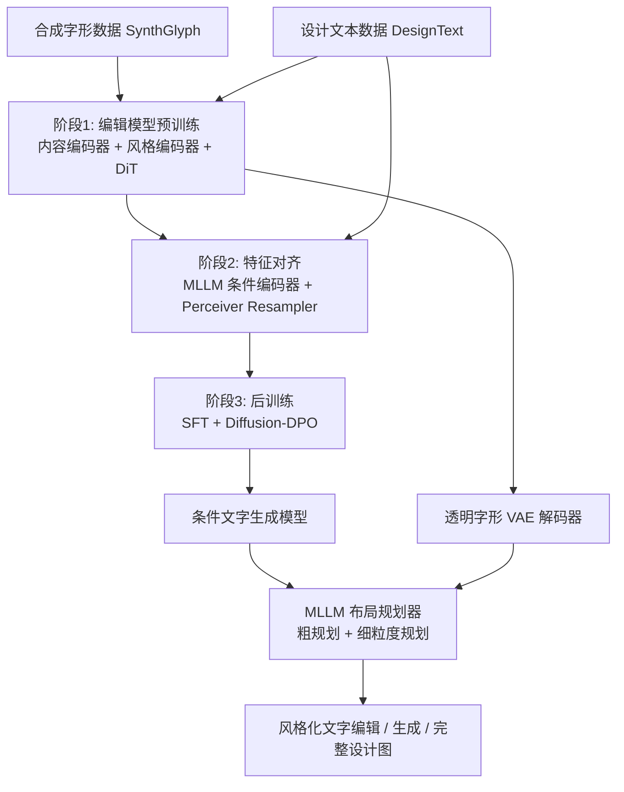

## 一句话总结

UTDesign 提出一个基于 DiT 的统一框架，通过"内容/风格解耦编辑模型 → 多模态条件对齐 → 生成模型后训练"的三阶段渐进训练，配合透明字形 VAE 与 MLLM 布局规划器，实现设计图像中中英文风格化文字的高精度编辑与生成，并可扩展为端到端的文到设计（T2D）流水线。

## 研究背景

AI 辅助平面设计正成为自动生成与编辑海报、横幅、广告等视觉元素的重要工具。一个典型的自动化设计系统包含背景生成、布局规划、风格化文字合成等子任务，其中艺术化文字渲染因直接决定成品的视觉质量而尤为关键。

尽管基于扩散的文到图（T2I）模型在视觉内容生成上表现出色，但它们在文字渲染上仍有明显短板：对小字号排版和中文等非拉丁文字尤其吃力，且往往缺乏在保持风格一致性前提下进行精细编辑的能力，难以满足需要精确修改既有文字元素的真实场景。此外，能达到 GPT-4o、Seedream 等闭源系统水平的开源模型仍然缺失。UTDesign 正是为填补这一空白而提出，目标是同时支持中英文的高精度风格化文字编辑与条件生成。

## 方法

### 整体框架

UTDesign 建立在 DiT 架构之上，采用三阶段渐进训练策略：先让模型学会字形内容与风格的解耦表示，再逐步掌握在复杂条件语境下应用这些风格。第一阶段在合成数据上从零训练带内容编码器与风格编码器的 DiT，实现保风格文字编辑；第二阶段引入基于 MLLM 的条件编码器，从设计背景与文本描述中提取引导条件，并与风格编码器的特征空间对齐；第三阶段用条件编码器替换风格编码器进行后训练，得到条件文字生成模型。最终整合透明字形 VAE 与 MLLM 布局规划器，构成完整的编辑与生成流水线。

### 关键设计

1. **内容/风格解耦的 DiT 编辑模型**：内容编码器采用预训练 DINOv2（捕捉字形结构），风格编码器采用预训练 CLIP（提取风格纹理特征），各接一个归一化 transformer 投影器映射到共享潜空间。内容与风格嵌入与噪声潜变量拼接后送入 DiT，融合块（Fusion DiT Block）中噪声潜变量通过全注意力同时关注内容与风格嵌入，并用 $$\tanh$$ 门控机制控制风格注入强度；采用 3D-RoPE 区分 token 类型与字符身份。训练遵循 Rectified Flow 框架，其目标为 $$\mathcal{L}_{rf}=\mathbb{E}_{x_0,x_1,t,R_c,R_s}\lVert v_\theta(x_t,t,R_c,R_s)-v_t\rVert_2^2$$。

2. **多模态条件对齐**：将设计背景与文本描述（图像描述、目标文字、边界框）输入冻结的 MLLM，取末层隐状态作为条件特征；用 Perceiver Resampler（可学习查询 token）把变长输出压成定长表示。仅训练 Resampler，用 L2 损失将条件特征对齐到已学到的风格嵌入空间：$$\mathcal{L}_{align}=\mathbb{E}_{R_s,B,D}\lVert P_\theta(M(B,D))-S(R_s)\rVert_2^2$$，从而无缝复用阶段一的解耦风格空间。

3. **后训练（SFT + DPO）与透明字形 VAE**：先在高质量子集上用 LoRA 做 Rectified Flow 的 SFT，再用美学奖励模型对 $$k$$ 个候选打分构造胜负对，按 Diffusion-DPO 目标优化以偏好高排名输出（参考模型即阶段一的编辑模型）。透明字形 VAE 复用 FLUX VAE 编码器，解码器扩展额外卷积层输出 alpha 通道，与 RGB 合并得到 RGBA 前景，用 L2 与 LPIPS 联合损失训练，支持可编辑的透明文字前景输出。

4. **两阶段布局规划器**：采用 MLLM 做布局规划，粗规划预测文本行边界框、细粒度规划确定行内每个字形位置（对中文这类字符级敏感语言尤为重要）。除 SFT 外，引入 GRPO 强化学习，用基于规则的奖励（mIoU 项 $$R_{iou}$$、重叠惩罚 $$R_{ol}$$、尺寸方差惩罚 $$R_{bl}$$）引导生成语义合理且视觉美观的布局。

## 实验结果

作者构建了统一评测基准 UTDesign-Bench（含编辑子集 Edit 与生成子集 Gen，各从 DesignText 测试集采样 1000 例），从图像质量（FID、LPIPS、CLIP-Sim）与文字渲染准确性（Precision、Recall、F-Score、NED、Accuracy，基于 PP-OCRv4）两方面评估。下表为系统级对比（↓越低越好，↑越高越好）：

| 方法 | 任务 | FID↓ | LPIPS↓ | CLIP-Sim↑ | F-Score↑ | NED↓ | Accuracy↑ |
|---|---|---|---|---|---|---|---|
| DiffUTE | Edit | 41.48 | 0.2676 | 0.6352 | 0.1967 | 0.8457 | 0.0387 |
| AnyText-Edit | Edit | 21.45 | 0.1950 | 0.7255 | 0.6049 | 0.4425 | 0.3538 |
| AnyText2-Edit | Edit | 20.68 | 0.2042 | 0.7313 | 0.5704 | 0.4809 | 0.3029 |
| Ours | Edit | 10.81 | 0.0883 | 0.8222 | 0.9518 | 0.0612 | 0.8370 |
| Glyph-ByT5-v2 | Gen | 92.82 | 0.6987 | 0.2465 | 0.8862 | 0.2764 | 0.6200 |
| Seedream 3.0 | Gen | 72.49 | 0.6903 | 0.2704 | 0.8392 | 0.2203 | 0.4885 |
| GPT-4o | Gen | 80.93 | 0.7390 | 0.2710 | 0.8506 | 0.1932 | 0.5772 |
| Ours | Gen | 72.07 | 0.6973 | 0.2609 | 0.8716 | 0.1590 | 0.6840 |

在编辑任务上，UTDesign 在所有指标上大幅领先开源基线（Accuracy 0.8370，FID 10.81）。在生成任务上，其文字渲染准确性（NED 0.1590、Accuracy 0.6840）超过所有开源与闭源对比方法，图像质量与闭源系统相当。用户研究显示其在文字准确性上相对 Seedream 3.0 与 GPT-4o 具有明显优势。消融实验进一步表明 SFT 与 DPO 逐步提升生成质量与文字准确性，GRPO 显著提升布局规划的 mIoU 与均衡性。

## 亮点与局限

亮点：
- 通过内容/风格解耦的渐进式三阶段训练，把"编辑"与"条件生成"统一在同一 DiT 框架内，并让生成模型复用编辑模型学到的解耦风格空间。
- 透明字形 VAE 原生输出 RGBA 前景，便于与场景文字检测、布局合成等真实编辑工作流无缝衔接。
- 同时支持中英文，开源模型在文字准确性上追平甚至超越闭源商业系统，并公开了代码与数据。

局限：
- 依赖 OCR（PP-OCRv4）评测，作者也指出 OCR 自身误差会使测量结果与真实性能存在偏差；且 FID 等指标未必贴合人类偏好。
- 生成任务的图像质量（FID、CLIP-Sim）相较闭源系统仍未全面领先，整体优势主要体现在文字渲染。
- 流水线依赖较多外部组件（预训练 T2I、inpainting、MLLM 规划器），系统复杂度较高。

## 延伸思考

UTDesign 的核心思路——先在合成数据上学一个高度解耦、可精确控制的表示，再通过特征对齐把该表示"接"到更弱结构化但更贴近真实的条件信号上——是一种颇具通用性的范式，可能迁移到其他需要"精确控制 + 真实条件"的生成任务（如图标、UI 元素、矢量图形合成）。另一个值得深挖的点是评测：文字渲染领域普遍受限于 OCR 与 FID 的偏差，如何构建更贴合人类审美与可读性的自动化评测指标，可能是推动该方向进一步落地的关键。此外，将布局规划的强化学习奖励从规则化（IoU、重叠、尺寸方差）扩展到融入美学与语义的可学习奖励，或能进一步缩小与专业设计师的差距。
