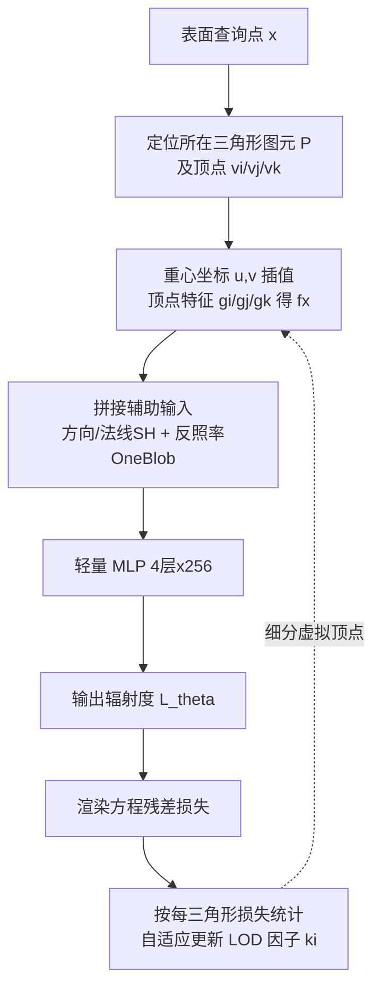

## 一句话总结

本文提出神经顶点特征（neural vertex features），把可学习特征直接存储在场景网格的顶点上、用重心坐标插值查询，替代把特征散布到 3D 空间的多分辨率哈希网格，在神经辐射度等任务中把编码显存降到网格方法的五分之一甚至更低，同时保持相当的渲染质量并降低推理开销。

## 研究背景

全局光照是图形学的重要课题，近年大量方法借助深度学习实现真实感的全局光照。这类神经渲染方法通常遵循"输入编码提取空间特征 → 轻量 MLP 解码输出"的流程，其中输入编码对性能至关重要。

被广泛采用的网格编码（如 Instant-NGP 的多分辨率哈希网格）用结构化 3D 网格散布空间特征，从而可以配合紧凑的 MLP 并加速收敛。但它有一个根本性的低效：特征被分配到空场景空间，而不是严格贴着场景表面。即便用哈希存储，实际使用的特征也只占哈希表容量的 55% 到 72%，造成显存浪费。

这在硬件层面尤为要命：随着带张量加速器的并行硬件迭代，越来越多神经负载变成显存受限（memory-limited），显存访问成为主要性能瓶颈。即便是前沿 GPU 的 L2 缓存也不足 72MB，常用神经网络难以装进缓存。作者由此提出：既然神经渲染的查询本就发生在场景表面，不如把特征直接放到表面几何上。

## 方法

整体框架：利用显式网格已经定义好的顶点与边，把可学习特征直接挂在网格顶点上；对任意表面查询点，用其所在三角形的重心坐标对三个顶点特征做插值得到该点特征，再拼接方向、法线、反照率等辅助输入送入 MLP，按神经辐射度的渲染方程残差进行优化。

关键设计：

- **神经顶点特征（Neural Vertex Features）**：维护特征数组 $$G \in \mathbb{R}^{n \times d}$$，$$n$$ 是顶点数、$$d$$ 是特征维度，每个顶点 $$v_i$$ 按索引唯一对应特征 $$g_i$$。对查询点 x，先确定其所在三角图元的顶点 $$\lbrace v_i, v_j, v_k \rbrace$$，再做重心插值 $$f_x = (1-u-v)\cdot g_i + u\cdot g_j + v\cdot g_k$$。图元 ID 与重心坐标在光线追踪求交或光栅化片元着色阶段本就会算出，几乎不引入额外开销。这样特征紧贴表面、随几何 2D 尺度增长，而非随空间 3D 体积增长。

- **多分辨率表面特征编码**：顶点特征的表达力受网格密度限制，粗网格区域难以表达高频光照细节。为此引入每面的细节层级（LOD）因子 $$k_i$$，把三角形每条边分成 $$k_i$$ 段、在面内形成规则三角网格，并给每个"虚拟顶点"分配可训练特征——从而在不改变原始网格拓扑的前提下加密特征。查询时先算整数格坐标 $$\bar{u}=\lfloor ku \rfloor$$、$$\bar{v}=\lfloor kv \rfloor$$ 定位所在虚拟子三角形，再在其中做局部重心插值。

- **基于损失的自适应细分**：所有 $$k_i$$ 初值为 1（不加虚拟顶点），训练中按每三角形的平均损失统计自适应上调。用辐射度加权后的损失 $$L(i)' = L(i)\cdot \log(R(i)+1)$$，当 $$L(i)' > L'_{\text{mean}} + 2\cdot L'_{\text{std}}$$ 时按超出的标准差倍数增大 $$k_i$$，把分辨率优先分配给难拟合区域（多为地板、墙面等初始低网格密度处）。

- **面向特征分布的重要性采样**：由于特征在表面上非均匀分布，纯按面积采样会导致训练低效（低特征密度区先收敛）。作者用面积概率 $$p_{\text{area}}(i)=A(i)/A_{\text{total}}$$ 与顶点数概率 $$p_{\text{vertex}}(i)=N(i)/N_{\text{total}}$$ 的混合 $$p(i)=\alpha\cdot p_{\text{area}}(i)+(1-\alpha)\cdot p_{\text{vertex}}(i)$$（$$\alpha=0.5$$）来采样，其中 $$N(i)=(k_i+1)(k_i+2)/2$$ 随细分同步更新。

- **静态/动态任务适配**：静态场景直接以渲染方程残差 $$r_\theta(x,\omega_o)$$ 为逐点损失，用蒙特卡洛积分估计；动态场景沿用 Dynamic Neural Radiosity 的显式场景向量 $$v \in \mathbb{R}^n$$（每个标量编码一个动画组件的状态），额外叠加特征平面 $$f_{XV}$$ 与频率编码 $$f_V$$ 建模动态维度，顶点特征只负责纯空间信息。此外用反照率因式分解把纹理项从学习目标中解耦，减轻网络负担。

## 实验结果

在 Mitsuba3 + tiny-cuda-nn、RTX 4090 上实现。静态场景基于 Neural Radiosity，与不同哈希表大小（每层 $$2^{17}$$–$$2^{19}$$ 特征）的多分辨率哈希网格对比，两者均训练 2–3 小时。下表为编码与 MLP 组件的显存（MB）/ 耗时（ms）对比：

| 方法 | 组件 | Dining Room | Living Room | Veach Door |
|------|------|-------------|-------------|------------|
| Hash17 | Encoding | 13.9 / 32.2 | 13.9 / 32.2 | 13.9 / 32.1 |
| Hash17 | MLP | 1.1 / 27.2 | 1.1 / 27.4 | 1.1 / 27.4 |
| Hash18 | Encoding | 33.9 / 32.1 | 33.9 / 32.1 | 33.9 / 32.1 |
| Hash18 | MLP | 1.1 / 27.7 | 1.1 / 27.5 | 1.1 / 27.4 |
| Hash19 | Encoding | 41.9 / 32.1 | 41.9 / 32.2 | 41.9 / 32.1 |
| Hash19 | MLP | 1.1 / 27.5 | 1.1 / 27.4 | 1.1 / 27.4 |
| **Ours** | Encoding | **3.7 / 27.6** | **4.3 / 23.1** | **3.8 / 13.6** |
| **Ours** | MLP | 1.1 / 27.1 | 1.1 / 27.1 | 1.1 / 23.1 |

顶点编码的显存远低于各哈希配置（如 Dining Room 3.7MB 对比 Hash19 的 41.9MB），并带来小幅性能提升；视觉上（Fig. 8）随哈希表容量下降，网格方法在高频细节处趋于模糊、在平滑着色过渡处出现网格状伪影，而本文方法因特征与几何相干对齐、可显式处理顶点边处的着色跳变，质量更好。动态场景（对比 DNR）中，本文把 3D 哈希网格换成顶点编码后显存约减少 5 倍（如 Dining Room 编码 105MB 降到 7.4MB），并同样避免网格伪影，视觉质量与 DNR 相当。

## 亮点与局限

亮点：

- 用"把特征放到网格顶点、重心插值查询"这一简单而自然的思路，利用几何先验直接剔除空场景的冗余特征，显存降到网格方法的五分之一甚至更低，同时更贴合现代 GPU 的缓存层级、推理更快。
- 图元 ID 与重心坐标在既有光追/光栅化管线中本就产生，几乎零额外开销，易于集成到多种下游任务（神经辐射度、动态神经辐射度、神经路径引导均验证有效）。
- 自适应 LOD 在不改动原始网格拓扑的前提下，把分辨率精准补到高频、低密度区域，避免手工加密网格的高成本。

局限：

- 方法本质上受限于表面表示，无法直接用于体数据或没有显式表面几何的场景。
- 只细分特征而不简化底层网格（为保几何细节），留下了"特征细化 + 网格简化"结合的效率空间。
- 动态场景仍依赖网格式编码（$$f_{XV}$$、$$f_V$$）建模高维动态分量，用浅层 MLP 在高维空间建模会引入帧间不一致等时序不稳定（与 DNR 同源问题），尤其在运动物体投下的高频阴影区域。

## 延伸思考

这项工作的核心启示是：当任务的查询天然发生在表面上时，与其在整个 3D 空间"撒特征"再靠哈希压缩，不如让特征表示直接对齐任务的内在维度（表面是 2D 流形）。这与 k-planes、学习索引、mesh 上的神经场（如 MeshFeat）等一系列"降维/贴合"思路殊途同归，但顶点特征在渲染管线中的零成本查询是其独特优势。顺着作者提出的方向，表面编码与稀疏体特征的混合表示、以及特征细化与网格简化的联合优化，可能进一步拓宽适用场景类型；而动态场景的时序稳定性问题，或许需要比"浅层 MLP + 特征平面"更结构化的时空表示来根治。
