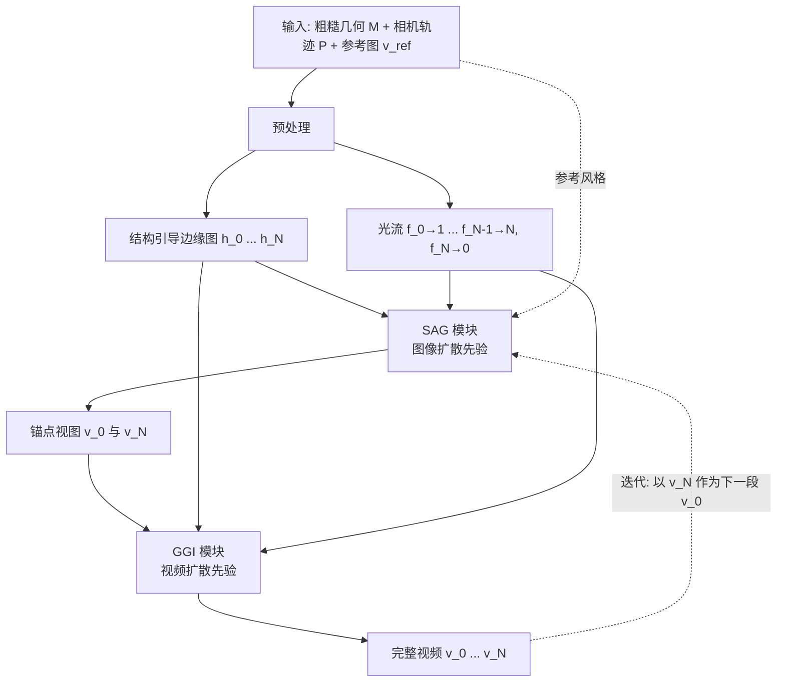

## 一句话总结

VideoFrom3D 用图像扩散模型生成高质量、跨视角一致的稀疏锚点视图，再用视频扩散模型在锚点之间插帧，从而仅凭粗糙几何、相机轨迹和一张参考图，就能合成风格一致、结构忠实的高质量 3D 场景视频。

## 研究背景

3D 图形设计的传统流程要经过概念设计、建模、贴图、打光、渲染等阶段，且往往需要反复迭代。哪怕只是改动相机轨迹或场景布局这样的小变化，都可能牵连到大量已完成的建模、贴图和打光工作，导致成本急剧上升。

一个直觉的做法是：把几何信息（比如深度图）通过 ControlNet 喂给视频扩散模型直接出片。但作者指出这条路存在根本瓶颈：视频扩散模型要同时兼顾单帧质量、运动合理性和时序一致性，在复杂场景下的单帧画质明显不如专注于静帧的图像扩散模型。论文用实验佐证了这一点，参数量更大的视频模型反而在画质与美学指标上落后于图像模型。

另一条替代路线是给网格做贴图再渲染，但它要求精细几何才能出效果，用在粗糙几何上会产生诸如花草被压平贴在平面地面上的瑕疵，而且贴图是静态的，无法表现反射、火焰跳动、水流这类动态视效。

## 方法

### 整体框架

VideoFrom3D 的核心思路是让图像扩散与视频扩散取长补短：先用图像扩散模型生成少量高质量、多视角一致的锚点视图，再用视频扩散模型把锚点之间的中间帧插出来。整个流程分为三个阶段：预处理、稀疏锚点视图生成（SAG）、几何引导的生成式插帧（GGI）。

### 关键设计

**结构引导用边缘图而非深度或法线。** 预处理阶段从几何和相机轨迹中提取两类信息：结构引导 $$h_i$$（2D 边缘图）和光流 $$f_{i \to j}$$。作者选用边缘图作为结构条件，因为深度图存在跨模型的尺度不一致问题、且对建筑窗户这类微小深度差不敏感；法线图虽然尺度不变，但当相邻不同表面法线接近时难以刻画边界。边缘图既尺度不变又能精确定义物体边界，鲁棒地保持形状。光流则通过在网格上回投坐标编码色图、再重投影到目标视角来建立稠密对应关系。

**SAG 模块的稀疏外观引导采样保证锚点一致。** SAG 基于 FLUX-dev 文生图模型，通过三点满足要求：用预训练的 HED 边缘 ControlNet 施加结构约束（避免需要 3D 模型边缘与真实图像配对的数据集）；用 LoRA 在参考图上做分布对齐以匹配风格；用"稀疏外观引导采样"保证 $$v_0$$ 与 $$v_N$$ 的跨视角一致。具体做法是先用光流 $$f_{N \to 0}$$ 把 $$v_0$$ 扭曲到 $$v_N$$ 视角得到稀疏观测 $$v_{0 \to N}$$，再在扩散采样的早期时间步做隐变量替换 $$z_t \leftarrow \bar{m} \odot \bar{z}_t + (1 - \bar{m}) \odot z_t$$，只把语义与色彩信息注入观测区域而不带入扭曲细节。作者强调这一策略之所以成立，全靠事先的风格分布对齐把解空间收窄到参考风格，否则未观测区域过大会导致明显接缝和内容漂移。

**GGI 模块用光流扭曲噪声加边缘条件做插帧。** GGI 基于图生视频模型 CogVideoX-5B，把起止帧 $$v_0$$、$$v_N$$ 的 VAE 隐变量与中间帧的零隐变量沿时间维堆叠后与噪声隐变量拼接。相机控制上借鉴 Go-with-the-Flow，用连续光流递归扭曲初始噪声得到隐式编码相机运动的扭曲噪声 $$\epsilon_w$$，并配合预训练的 flow-aware LoRA。由于扭曲噪声在下采样隐空间中构建、且为保持高斯性会不断重注噪声导致运动信息只是隐式编码，单靠它难以精确控制相机，因此额外把 HED 边缘图的 VAE 编码拼接进来作为结构引导。采样步表示为 $$\epsilon_{\Theta, \pi}(Z_t \oplus V \oplus \mathcal{E}([h_0, \cdots, h_N]), t) \mapsto Z_{t-1}$$。

**无需配对数据集的训练策略。** GGI 用 DL3DV-10K 静态场景视频训练，用 RAFT 算光流得到扭曲噪声。由于数据集缺少 3D 模型对应的边缘图，作者用估计深度图再跑 HED 检测来合成边缘图（记为 HED-S），因为深度图天然无纹理、HED 只提取强结构轮廓，合成结果接近推理时的结构引导，有效缩小了训练与推理的域差距。

## 实验结果

作者构建了 16 个 3D 模型（4 物体、2 室内、8 室外、2 室内外过渡），每个合成 3 种风格共 48 段视频，与仅用视频扩散的 Depth-I2V、VACE，以及用 SAG 锚点视图增强的少样本重建方法 MVSplat360、LVSM、SEVA 对比。评估涵盖视觉保真度（PSNR/SSIM/LPIPS）、结构保真度（PSNR-D）、视觉质量（CLIP-A/MUSIQ）与风格一致性（CLIP-I/SC/BC）。

| 方法 | PSNR↑ | SSIM↑ | LPIPS↓ | PSNR-D↑ | CLIP-A↑ | MUSIQ↑ | CLIP-I↑ | SC↑ | BC↑ |
|------|-------|-------|--------|---------|---------|--------|---------|-----|-----|
| Depth-I2V | - | - | - | 20.696 | 6.136 | 65.240 | 0.787 | 0.864 | 0.920 |
| VACE | - | - | - | 18.850 | 6.189 | 65.318 | 0.787 | 0.856 | 0.914 |
| SAG + MVSplat360 | 13.163 | 0.374 | 0.315 | 13.881 | 5.714 | 50.524 | 0.788 | 0.797 | 0.894 |
| SAG + LVSM | 15.103 | 0.472 | 0.280 | 15.222 | 5.680 | 50.323 | 0.804 | 0.843 | 0.917 |
| SAG + SEVA | 14.014 | 0.437 | 0.261 | 16.598 | 6.782 | 66.359 | 0.834 | 0.884 | 0.939 |
| SAG + GGI（本文） | **16.739** | **0.554** | **0.236** | 19.754 | 6.730 | **68.615** | **0.840** | **0.891** | **0.942** |

本文方法在多数指标上取得最优、少数指标次优。消融显示：去掉稀疏外观引导采样，锚点视图的屋顶、窗户、立面颜色会明显偏离起始帧；GGI 若不加结构条件会出现严重畸变，直接用 RGB 提取的 HED 边缘会丢细节，而模拟的 HED-S 兼顾结构保持与细节。此外仅用 SAG 逐帧生成会出现严重闪烁，印证了 GGI 对时序一致性的必要性。延迟方面（A100-80GB），LoRA 分布对齐约 27 分钟/风格，单条轨迹生成约 197 秒。

## 亮点与局限

亮点：巧妙地把"图像扩散擅长单帧画质、视频扩散擅长时序一致"这一互补性拆成 SAG 与 GGI 两个模块，用锚点生成加插帧的策略绕开了视频扩散在复杂场景下画质不足的瓶颈；全流程不依赖 3D 模型与真实图像的配对数据集，用 HED 边缘和深度合成边缘巧妙规避了数据难题；支持多风格标识符、后置提示词做季节/色调变化，甚至能在一段视频里做风格随时间渐变。

局限：不支持实时交互式相机控制；扩散模型固有的随机性仍可能带来时序不一致；需要 LoRA 训练，计算耗时较大（每种风格约 27 分钟）；方法不强制像素级的跨视角一致，也不支持实时导航。

## 延伸思考

这套"稀疏锚点 + 生成式插帧"的分工范式，本质上是在用图像模型的强空间先验去锚定视频模型薄弱的单帧质量，再让视频模型专注做它擅长的时序过渡，很像把一个难以联合优化的目标做了任务分解。这一思路对其他"质量与一致性难以兼得"的生成任务（如长视频、4D 内容）或许有借鉴意义。

一个值得关注的点是对边缘图而非深度/法线的偏好：论文的分析说明了结构条件的"分布匹配"比信息量本身更关键——HED 边缘之所以有效，正因为其估计器训练在稀疏人工标注边缘上，恰好贴合 3D 模型导出边缘的分布。这提醒我们在选择条件信号时，条件与预训练模型先验的分布契合度可能比条件的物理精确性更重要。

局限中的 LoRA 训练耗时是实用化的主要障碍，若能把风格对齐做成免训练或前馈式，将大幅提升在早期设计迭代场景中的可用性。
