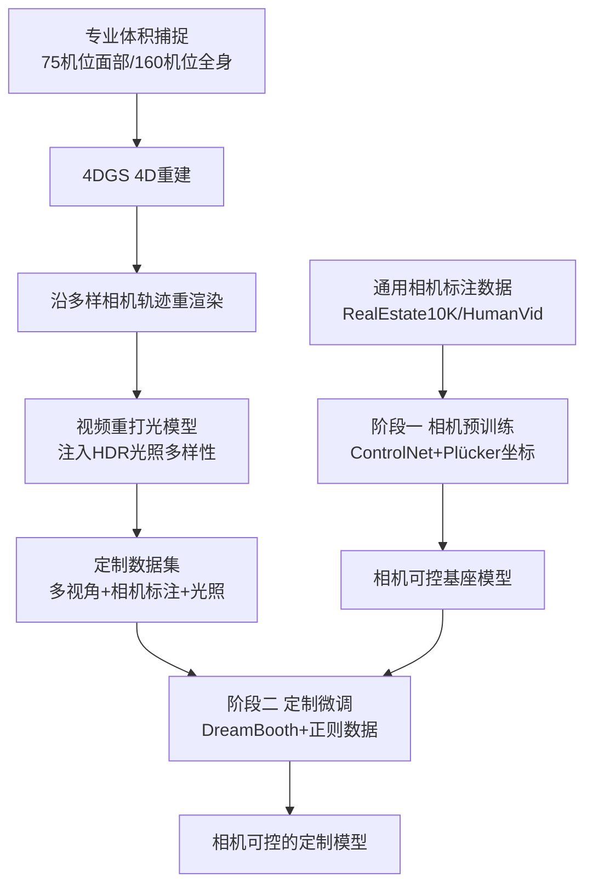

## 一句话总结

本文提出一条面向虚拟制作的定制化数据流水线：把专业级体积捕捉（volumetric capture）经 4D 高斯泼溅（4DGS）重渲染成"任意相机轨迹 + 多光照"的多视角训练数据，用它微调视频扩散模型，从而同时实现"跨视角身份保持"与"精确 3D 相机控制"，并支持多主体合成、场景定制与动作/布局控制。

## 研究背景

虚拟制作正在把实拍与 CG 元素融合，视频生成模型被越来越多地接入这条流水线，用来生成含特定角色的新场景。其中两个能力尤为关键：一是"主体定制"——生成指定角色出演的新镜头；二是电影级的相机运动控制——镜头移动能传达视角与情绪，但也会把主体从多个角度暴露出来，对身份一致性提出挑战。

现有方法难以兼顾这两点。多数定制方法只用单张参考图（如 VideoBooth、ConsisID），缺乏视角多样性，当主体从新角度被观察时身份会漂移；而在定制过程中能提供的相机控制也很有限，例如 MotionBooth 只支持 2D 平移，无法覆盖影视里常见的 3D 运镜。核心症结在于缺少一种既含丰富多视角身份信息、又带精确相机标注的定制数据。本文把原本用于 4D 重建的 4DGS 重新定位为"数据生成器"，用它来补齐这块数据缺口。

## 方法

### 整体框架

方法分为"数据流水线"与"两阶段训练"两部分。数据侧：用专业体积捕捉设备录制人物表演，经 4DGS 重建后沿多样相机轨迹重渲染，再用视频重打光模型注入 HDR 光照变化，得到多视角、带精确相机标注、光照多样的定制数据集。训练侧：先在通用带相机标注数据上做相机预训练，再在定制数据上微调，使模型在保持相机可控性的同时学到特定主体的多视角身份细节。

### 关键设计

1. **把 4DGS 当作数据生成器**：用 75 机位面部装置与 160 机位全身装置采集人物表演，经 4DGS 重建后，可沿任意相机轨迹（起止点在 2 到 10 米半径内随机采样并线性插值成平滑路径）渲染出高保真多视角视频。这样既拿到了 4DGS 的精确多视角与相机标注，又保留了视频生成模型创造新内容的泛化力，正好互补。

2. **两阶段训练**：阶段一用受 AC3D 启发的 ControlNet 架构，相机以 Plücker 坐标表示，经全卷积编码后与主 DiT 的视频 token 逐 token 相加注入；相机条件仅在前 40% 去噪步和前 25% 的 DiT 块上施加以兼顾可控性与画质，此阶段冻结主 DiT 只训 ControlNet。阶段二用 DreamBooth 在主体数据上微调，同时用从预训练数据采样的正则集防止遗忘通用生成与相机控制能力，每个主体绑定一个独有 token。

3. **多光照增强**：借助可泛化视频重打光模型 Lux Post Facto 与 Poly Haven 的 HDRI，把重渲染视频扩展出多种光照条件，让模型学会光照适配，避免生成结果"平光化"。

4. **多主体生成的两条路线**：一是联合训练——在各自单主体数据上微调并辅以少量"双主体同框"数据，推理时组合各主体 token；二是噪声融合（noise blending），先用通用提示生成粗布局视频，用 SA2VA/SAM2 分割出各主体的时空掩码 $$M_i$$，前 10% 去噪步不加定制以稳住布局，之后每步用各自定制模型分别预测 $$z^{i}_{t-1}$$ 并按掩码融合 $$z_{t-1}=\sum_i M_i * z^{i}_{t-1}$$，从而无需重训即可模块化组合独立定制的模型。

## 实验结果

在两位受试者 Alex 与 Emily 的定制任务上，与多种个性化/相机控制基线对比。下表摘自文本到视频（T2V）定制的主实验，AdaFace 衡量多视角身份相似度，CLIP-T/CLIP-I 衡量文本对齐与帧一致性，用户研究列为该方法在"多视角身份保持"标准下被偏好的比例（⇑ 越高越好）：

| 方法 | AdaFace ⇑ | CLIP-T ⇑ | CLIP-I ⇑ | 背景一致性 | 用户偏好·多视角身份 ⇑ |
|---|---|---|---|---|---|
| MagicMe | 0.280 | 0.303 | 0.991 | 0.967 | 3.18% |
| DreamVideo | 0.194 | 0.318 | 0.961 | 0.918 | 0.98% |
| VideoBooth | 0.279 | 0.274 | 0.966 | 0.941 | 1.54% |
| MotionBooth | 0.191 | 0.324 | 0.954 | 0.904 | 2.20% |
| ConsisID | 0.301 | 0.355 | 0.981 | 0.892 | 12.96% |
| 本文 Ours | 0.351 | 0.356 | 0.991 | 0.946 | 81.34% |
| 本文（仅正面视角） | 0.327 | 0.353 | 0.989 | 0.952 | - |

本文在 AdaFace 与用户偏好上均大幅领先；"仅正面视角"消融的 AdaFace 从 0.351 降到 0.327，印证多视角数据对身份保持的作用。相机控制方面（另一张表），本文预训练模型的平移误差 0.267、旋转误差 0.047 均优于 CameraCtrl 与 AC3D，且去掉定制时的相机运动会使误差上升。重光照消融中 83.9% 的参与者偏好带重光照数据训练的模型；多主体的噪声融合方案 AdaFace 0.320，略低于联合训练的 0.337，但换来了免重训的模块化组合能力。

## 亮点与局限

亮点：
- 把 4DGS 从"重建工具"重新定位为"定制数据生成器"，用可控合成数据一举补齐多视角身份与 3D 相机标注两类稀缺监督。
- 首个显式在精确 3D 相机运动下保持多视角身份的框架，并覆盖多主体、场景定制、真实视频定制、动作与布局控制等虚拟制作全链路能力。
- 噪声融合让独立定制的单主体模型可在推理时按分割掩码拼装成多主体场景，无需为每种组合重训。

局限：
- 需要微调才能充分利用高质量多视角 4DGS 数据，流程较重。
- 采用的 CogVideoX 基座分辨率偏低，未能充分发挥高分辨率输入的价值。

## 延伸思考

这项工作最有启发的一点，是把"高保真 3D/4D 重建"与"生成模型"从对立变成互补：重建负责提供物理准确、可精确标注的多视角与相机监督，生成模型负责创造新内容与新语境。这种"用可控合成数据喂养生成模型"的范式，可能同样适用于光照、材质、姿态等其他难以在真实世界配对采集的属性。另一方面，方法对专业体积捕捉装置（75 到 160 机位）的依赖构成了较高门槛，尽管论文用 iPhone 手持视频加 CUT3R 位姿估计验证了向真实场景的延展，但如何在不牺牲多视角一致性的前提下降低采集成本，仍是把这套流水线推向更广创作者群体的关键。此外，基座分辨率成为质量上限，也提示这类"数据驱动定制"的收益会随基础视频模型的升级而进一步释放。
