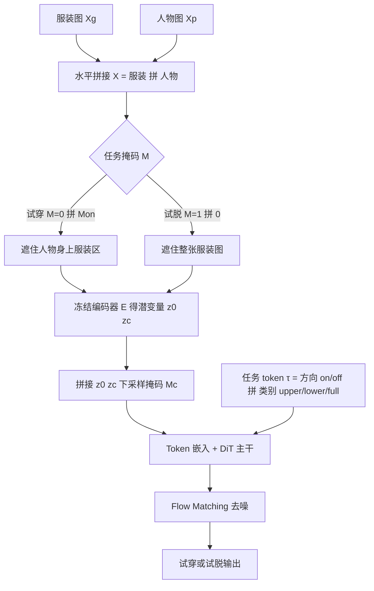

## 一句话总结

本文提出 Voost：用**单个扩散 Transformer（DiT）**同时学习虚拟试穿（VTON，把服装穿到人身上）与虚拟试脱（VTOFF，从穿着者反推出干净的服装图），两个任务互为逆过程、彼此监督，无需任务专用网络、辅助损失或额外标注，即在试穿与试脱两个基准上同时达到 SOTA。

## 研究背景

虚拟试穿旨在合成"某人穿上目标服装"的真实图像，核心难点是精确建模**服装—人体对应关系**，尤其在姿态与外观变化下容易失效。已有路线各有短板：

- 早期基于变形（warping）的方法把服装图对齐到目标人体姿态，难以保住服装细节与结构一致性。
- GAN 时代方法真实感提升，但仍难保留服装细节。
- 借助大规模文生图扩散模型作先验的近期方法，通过辅助损失、参考网络（reference/dual network）、外部图像编码器或空间拼接来加强对应关系，但往往服装—人体耦合偏弱，或引入额外模块反而损害生成质量。作者通过注意力图分析指出：像 CatVTON 这类方法注意力弥散、与查询点无关，反映空间定位（spatial grounding）薄弱。

与试穿相反的**试脱**任务（从穿着者恢复干净服装图）研究极少，且因遮挡、褶皱、形变而困难，同样需要强关系建模。作者主张把两者统一到一个共享空间布局的 DiT 框架里联合学习。

## 方法

核心思路：把服装图和人物图**水平拼接**成一张组合图送入共享的扩散 Transformer，通过对不同区域施加掩码，把"同一套输入布局"复用为试穿或试脱两个方向；两个方向联合训练，使每个"服装—人物"对天然为反向过程提供监督。

### 统一输入布局与任务 token

设服装图 $$X_g \in \mathbb{R}^{H \times W \times 3}$$，人物图 $$X_p \in \mathbb{R}^{H \times W \times 3}$$，水平拼接为 $$X = [X_g \mid X_p] \in \mathbb{R}^{H \times 2W \times 3}$$。用二值掩码 $$M \in \{0,1\}^{H \times 2W}$$ 定义修补区：

- 试穿：$$M = [0 \mid M_{on}]$$，遮住人物图 $$X_p$$ 中的服装区、保留服装图 $$X_g$$；
- 试脱：$$M = [1 \mid 0]$$，整张服装图被遮、人物图完整保留。

掩码输入为 $$X_{masked} = X \odot (1 - M)$$。完整图与掩码图经冻结编码器 $$E$$ 得 $$z_0 = E(X)$$、$$z_c = E(X_{masked})$$，掩码经 pixel-unshuffle 下采样到潜空间分辨率得 $$M_c$$，三者沿通道拼接后过 token 嵌入送入 DiT。任务 token $$\tau = [\tau_{mode} \mid \tau_{category}]$$，其中 $$\tau_{mode} \in \{on, off\}$$ 指定生成方向，$$\tau_{category} \in \{upper, lower, full\}$$ 编码服装类型，作为额外条件传入 Transformer。

### 动态布局与训练目标

借助 ViT/DiT 的 token 化表示，框架支持任意分辨率与长宽比输入（$$H$$、$$W$$ 无需固定），用 padding token 补齐到最大长度 $$N_{max}$$ 做批训练，并用旋转位置编码 RoPE 稳健处理多样长宽比。训练采用 **flow matching（rectified flow）**，令数据潜变量 $$z_0$$ 与噪声 $$z_1 \sim \mathcal{N}(0, I)$$ 之间为直线轨迹：

$$
z_t = (1-t)z_0 + t z_1, \quad t \in [0,1]
$$

模型预测速度场，统一训练目标为：

$$
L_{unified} = \mathbb{E}_{t, z_0, z_1}\left[\left\| \epsilon(z_t, z_c, M, \tau, t) - \frac{dz_t}{dt} \right\|^2\right]
$$

为保留预训练 DiT 的生成先验，只微调各 Transformer block 内的**注意力模块**，其余冻结。消融显示这种 attention-only 微调（2.69B 可训练参数）优于全量微调（11.9B）、单 block 训练与 LoRA，兼顾对应建模能力与训练成本。

### 推理期技巧 1：注意力温度缩放

训练支持多长宽比，但推理时分辨率或掩码占比常偏离训练分布，导致注意力行为次优。作者引入自适应温度缩放：

$$
\lambda' = \sqrt{\frac{1}{d}} \cdot \sqrt{\frac{\alpha \cdot \log(N_{infer})}{\log(N_{train})}} \cdot \sqrt{\frac{\log(N_{mask} + c)}{\log(\beta \cdot N_{garment} + c)}}
$$

其中 $$d$$ 为注意力 QKV 维度；$$N_{infer}$$、$$N_{train}$$ 为推理/训练总 token 数；$$N_{mask}$$、$$N_{garment}$$ 为掩码区与服装区 token 数；$$\alpha$$、$$\beta$$ 控制全局项与相对项权重，$$c$$ 为稳定小常数。全局项稳定不同 token 长度下的注意力，相对项适配掩码区与服装区的空间不平衡，在掩码占比很小时尤其能保住服装保真度。

### 推理期技巧 2：自校正采样

统一模型在共享布局下同时具备试穿与试脱能力。作者据此在推理时做自校正：一个忠实的试穿结果应隐含足够信息，能经反向试脱恢复原服装。在指定时间步 $$t \in T_{corr}$$，先用试穿 token 从当前潜变量 $$z_t$$ 预测穿着者图 $$\hat{z}_0^{on}$$，再以其为条件做反向试脱得重建服装 $$\hat{z}_0^{off}$$，计算它与条件服装 $$z_c$$ 的重建误差 $$\|\hat{z}_0^{off} - z_c\|^2$$，用其梯度反传更新 $$z_t$$，重复 $$R$$ 次逐步对齐生成与条件信号。该机制按需触发，不参与主定量基准。

## 实验结果

在 VITON-HD 与 DressCode 两个标准基准上评测，输出分辨率 1024×768，16× H100 训练、单 A100 推理。

试穿任务（VITON-HD，配对/非配对）：

| 方法 | SSIM↑ | LPIPS↓ | FID↓(paired) | KID↓(paired) | FID↓(unpaired) | KID↓(unpaired) |
| --- | --- | --- | --- | --- | --- | --- |
| StableVITON | 0.867 | 0.084 | 6.851 | 1.255 | 9.591 | 1.451 |
| OOTDiffusion | 0.851 | 0.096 | 6.520 | 0.896 | 9.672 | 1.206 |
| IDM-VTON | 0.881 | 0.079 | 6.343 | 1.322 | 9.613 | 1.639 |
| CatVTON | 0.869 | 0.097 | 6.141 | 0.964 | 9.141 | 1.267 |
| Leffa | 0.872 | 0.081 | 6.310 | 1.208 | 9.442 | 1.249 |
| Ours (VTON-only) | 0.868 | 0.079 | 5.804 | 0.618 | 9.112 | 1.051 |
| Ours (完整 Voost) | 0.898 | 0.056 | 5.269 | 0.404 | 8.982 | 0.899 |

在 DressCode 上同样全面领先（如配对 SSIM 0.933、LPIPS 0.044）。

试脱任务（VITON-HD）：

| 方法 | FID↓ | KID↓ |
| --- | --- | --- |
| TryOffDiff | 28.25 | 11.42 |
| TryOffAnyOne | 25.20 | 6.98 |
| Ours (VTOFF-only) | 12.88 | 3.54 |
| Ours (完整 Voost) | 10.06 | 2.48 |

关键结论：

- **双任务联合训练**优于各自的单任务版本（试穿、试脱两方向全指标均提升），说明联合学习培养了更可泛化的服装—人体对应先验；注意力图也更锐利、对应更精准。
- 用户研究中，Voost 在真实感、服装细节、服装结构三项标准上 top-1 选择率均最高。
- 温度缩放在两个基准上带来稳定提升，在掩码区偏小/空间不平衡的真实场景收益更明显；自校正能在初次生成不佳时恢复服装结构与细节。
- 单模型一套参数即可处理试穿与试脱，无需任务专用重训，且在野外图像（多样姿态、背景、光照）上鲁棒。

## 亮点与局限

亮点：
- 把试穿与试脱形式化为**双向互逆任务**放进单个 DiT，用共享的 token 级拼接布局实现互相监督，摆脱任务专用网络、辅助损失与额外标注。
- 动态布局 + RoPE + 任务 token 使单批次内容纳多种姿态、长宽比与构图，具备可扩展性；attention-only 微调在保留生成先验的同时大幅降本。
- 两个即插即用的推理期技巧（温度缩放、自校正采样）无需重训即提升对分辨率/掩码变化的鲁棒性与双向一致性。

局限与未来：
- 由于缺少显式的结构或尺码信息，对服装**合身度/版型**的精确控制仍模糊；未来拟引入身体测量、服装元数据等线索提升可控性。
- 作者指出其强图像级基础适合扩展到视频与 3D 试穿，但保持一致、忠实的服装—人体交互在这些场景仍具挑战。

## 延伸思考

Voost 最值得借鉴的一点是把"逆任务"当作免费监督信号：试穿与试脱共享布局、互为反向，既省去为试脱单独造网络与标注，又让自校正采样有了"生成—反演—比对"的闭环。这种"用可逆性做自监督/自校正"的思路，或可推广到其他成对生成任务（如图像上妆/卸妆、场景合成/分解）。同时，attention-only 微调在保住大扩散先验的前提下高效注入领域对应关系，为在超大 DiT 上做垂直任务适配提供了低成本范式。局限也点明方向：显式的尺码/版型条件与向视频、3D 的时序/几何一致性扩展，是把这类图像级试穿推向实用产品的关键。
