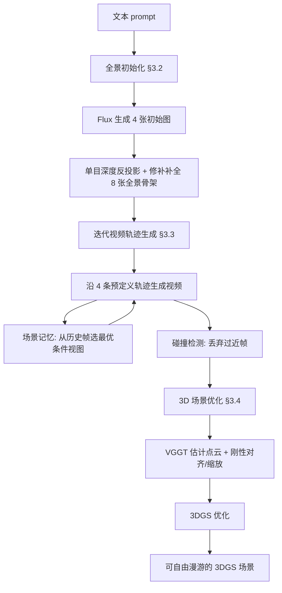

## 一句话总结

WorldExplorer 用"全景初始化 + 相机可控视频扩散的自回归轨迹生成 + 3D Gaussian Splatting 重建"三阶段流程，从一句文本生成可以在大范围视角下自由漫游、且视觉质量保持一致的 3D 场景。

## 研究背景

从文本生成 3D 世界是计算机视觉长期追求的目标，应用覆盖 AR/VR 资产制作、游戏与影视等。手工搭建这类环境耗时且需要专业技能，自动生成因此更具吸引力。随着文生图（T2I）与文生视频（T2V）模型成熟，把 2D 生成先验迁移到 3D 场景构建成为主流思路，但现有方法在"可探索性"上普遍受限：

- 基于 360° 全景的方法（如 DreamScene360、LayerPano3D）在场景中心附近能给出高质量视图，但无法补全全景视角之外的未观测区域，一旦相机偏离中心就出现遮挡与几何畸变；
- 基于 T2I 的迭代式"渲染—修补—重复"管线（如 Text2Room、WonderWorld）能生成超出全景的完整场景，但逐帧扩展物体几何依赖单目深度估计，误差不断累积，导致拉伸、扭曲等伪影；
- 更新的视频扩散方法虽然凭借连续运动的世界先验得到局部合理的几何，但生成的世界要么缺乏完整 360° 覆盖，要么在偏离中心的新视角下仍有畸变，无法真正交互式漫游。

WorldExplorer 的目标就是同时做到两点：既在中心视角保持高质量视图合成，又能在大范围相机运动下稳定地"绕到物体背后"自由探索。

## 方法

### 整体框架

方法把"从文本生成可漫游 3D 场景"拆成三个阶段：先用文生图与深度估计构造一个粗略的 360° 全景场景骨架（scaffold），再用相机可控的视频扩散模型沿多条预定义轨迹自回归地扩展观测，最后把所有生成图像融合进 3DGS 表示以支持实时漫游。核心创新是把大场景生成拆成多段不连续的短轨迹，并用"场景记忆（scene memory）"机制维持跨轨迹的 3D 一致性，用"碰撞检测"机制避免相机撞入物体的退化输出。

### 关键设计 1：全景初始化构建场景骨架

先用文生图模型 Flux 生成 4 张分别描述场景不同区域（如厨房、客厅）的初始图，并给它们分配朝外、绕中心均匀分布的偏航角 $$\theta_i \in \{0°, 90°, 180°, 270°\}$$，平移置零。再用单目深度估计把每张图反投影成点云 $$P_i = R_i K^{-1}[u,v,1]^{\top} \cdot D_i(u,v)$$，投影到 $$\{45°, 135°, 225°, 315°\}$$ 四个中间视角并修补未观测区域，得到 8 张全景骨架。相比常规文生全景，这种"先分别生成 4 张再拼"的做法能容纳差异极大的区域（例如室内厨房与室外森林并存），场景更多样，也给用户提供了直观的可编辑接口。

### 关键设计 2：迭代视频轨迹生成 + 碰撞检测

从骨架的每张初始图出发，用 4 条预定义轨迹（沿直线放大、向左/向右旋转、抬升/俯视）"钻进并绕行"局部区域，共生成 32 段视频。把大场景拆成多条不连续短轨迹的好处是：碰撞只需在每段轨迹内单独处理，一段撞墙不会影响后续轨迹（后者仍可从骨架重新出发）。碰撞检测先用视频深度估计得到归一化深度 $$\hat{D} \in [0,1]^{N \times H \times W}$$，在图像中心 20% 区域定义二值掩码 $$M$$，计算逐帧掩码平均深度：

$$\bar{d}_t = \frac{\sum_{u,v} M(u,v) \cdot \hat{D}_t(u,v)}{\sum_{u,v} M(u,v)}.$$

从第一个满足 $$\bar{d}_{t^*} < 0.4$$ 的帧 $$t^*$$ 起截断轨迹，只保留之前的帧，从而在相机贴近物体/墙面前及时停下。

### 关键设计 3：场景记忆保证跨轨迹 3D 一致性

每段轨迹按 21 帧一批生成，每批条件在 13 张历史帧上：前 8 张固定为全景骨架图，保证任何时刻都对全局布局有感知；剩余 5 张根据旋转相似度从"场景记忆"中动态挑选——记忆里存放此前所有轨迹生成过的图像与位姿，选取相对当前 21 帧位姿最接近的 top-5，并借助已知轨迹布局排除与当前轨迹初始图正对的相机。每段视频生成完成后，从第 3 帧起的新图像与相机被写入记忆供后续条件使用（前两帧因与全景图太像而不保存，以增加多样性）。该机制配合视频模型"先锚点后插值"的两阶段生成，使锚点跨轨迹一致，插值自然产出场景一致的中间帧。

### 关键设计 4：3D 场景优化

超过 1K 张生成图像使 COLMAP 过慢，因此改用 VGGT 直接估计稀疏点云，下采样到 20 万点作为 3DGS 初始化。由于 VGGT 在自己的坐标系里预测，需做对齐：用第 1 张图预测位姿与已知位姿求刚性变换 $$\pi_t = \pi_1 \hat{\pi}_1^{-1}$$，再按相机中心包围盒长度之比求缩放 $$s$$，最终把点云变换到已知世界系 $$P_{GS} = s \cdot \pi_t \cdot \hat{P}_{GS}$$。之后按标准 3DGS 损失优化：

$$L(x) = \frac{1}{N} \sum_{i=1}^{N} \left( \lambda_1 \lvert \hat{I}_i - I_i \rvert + \lambda_2 (1 - \mathrm{SSIM}(\hat{I}_i, I_i)) \right).$$

## 实验结果

作者在偏离场景中心的新视角渲染上评估 CLIP Score（CS）、Inception Score（IS），并做了 n=64 人的用户研究，评价感知质量（PQ）与 3D 一致性（3DC，1~5 分）。完整方法在文本相似度（CS）和用户研究两项上均领先，验证了全景初始化让骨架从一开始就贴合 prompt、以及场景记忆与碰撞检测对大视角漫游质量的关键作用。

| 方法 | CS ↑ | IS ↑ | PQ ↑ | 3DC ↑ |
|------|------|------|------|-------|
| DreamScene360 | 23.51 | 2.06 | 3.01 | 3.04 |
| LayerPano3D | 24.30 | 2.04 | 2.16 | 2.14 |
| Text2Room | 24.37 | 1.92 | 2.68 | 2.32 |
| WonderWorld | 19.74 | **2.23** | 2.34 | 1.75 |
| FlexWorld | 21.61 | **2.31** | 2.89 | 2.71 |
| SEVA | 21.63 | 2.13 | 2.51 | 1.91 |
| Ours (1 image) | 21.42 | 1.88 | 2.42 | 2.03 |
| Ours (4 images) | 25.65 | 2.29 | 2.48 | 2.14 |
| Ours (w/o scene-mem) | 25.91 | 2.21 | 2.61 | 2.36 |
| Ours (w/o coll-det) | 25.37 | 1.89 | 3.77 | 3.42 |
| Ours | **25.94** | 2.27 | **4.04** | **4.02** |

消融显示：去掉场景记忆或碰撞检测后，用户研究的感知质量与 3D 一致性明显下降（如去碰撞检测后 PQ 从 4.04 降到 3.77、3DC 从 4.02 降到 3.42），说明这两个机制是维持大视角漫游质量的核心；从单张图起步（Ours 1 image）远差于四张骨架起步，凸显全景初始化的价值。完整生成过程在单张 RTX3090 上平均约 7 小时，耗时主要来自视频生成阶段（约每条轨迹 10 分钟）。

## 亮点与局限

亮点：

- 首个"文本 → 可大范围漫游 3D 场景"方法，在偏离中心的极端视角下仍保持高质量视图合成，突破了全景类与迭代 T2I 类方法的探索性局限；
- 把大场景生成拆成多段不连续短轨迹，使碰撞处理局部化、互不干扰，是把视频扩散模型转化为大场景 3D 一致生成器的巧妙工程思路；
- 场景记忆机制用"固定全景锚点 + 按旋转相似度动态选取历史帧"兼顾全局布局感知与跨轨迹一致性，有效缓解视频模型的灾难性遗忘与重访不一致。

局限：

- 整体流程约 7 小时且以视频生成为瓶颈，离交互式创作还有距离；
- 轨迹为预定义的固定模式（放大/左右/抬升），并非按内容自适应规划，可能覆盖不到复杂布局的所有区域；
- 依赖多个外部先验（Flux、单目/视频深度、SEVA 式视频扩散、VGGT），任一环节的误差都会传导到最终 3DGS 场景。

## 延伸思考

这篇工作的核心洞察是：视频扩散模型天生擅长"局部连续运动"（绕物体转、钻进一小段），但不擅长沿单一长路径覆盖整个场景并保持全局一致。WorldExplorer 的应对不是去训练更强的长程视频模型，而是用"分而治之 + 显式记忆"把一致性问题从模型内部转移到系统设计层面——多条短轨迹降低单次生成难度，场景记忆显式维护跨段一致性。这种"用检索/记忆补偿生成模型上下文有限"的思路，与语言模型里的 RAG 有异曲同工之处，可能也适用于其他需要长程一致性的生成任务（如长视频、可编辑世界）。另一个值得关注的点是全景骨架先行带来的可控性：它不仅提升了 prompt 一致性，也天然给了用户"先摆四张图再生成"的编辑入口，这对把生成式 3D 推向实际创作工具很有启发。后续若能把固定轨迹替换为按内容自适应的探索策略、并压缩数小时的生成开销，这套框架有望更接近真正实时可交互的世界生成。
