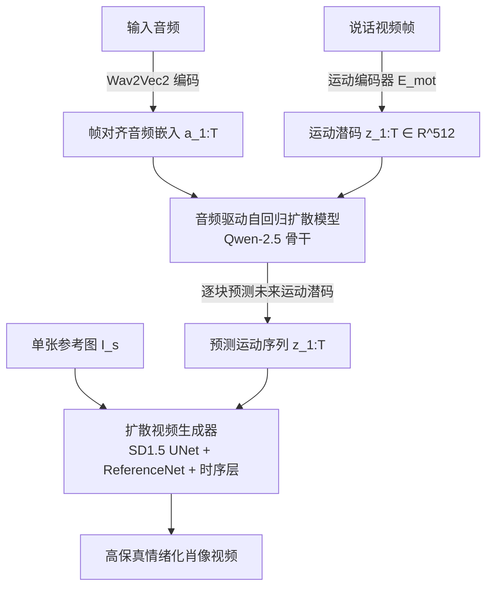

## 一句话总结

X-Actor 提出一种"运动生成与视频合成解耦"的两阶段框架，用音频驱动的自回归扩散模型在紧凑的身份无关面部运动潜空间中预测富有情绪表现力的长时序运动，再交由扩散视频生成器渲染，从而实现可无限延长、情绪连贯且口型精准的"演员级"肖像表演。

## 研究背景

现有的说话人头（talking head）生成方法大多聚焦于口型同步与短时视觉保真度，在受限的"说话"场景下表现不错，但难以胜任具有情绪深度、长时序连贯性与上下文感知运动演化的"演员级"表演。作者归纳出两类主流范式的局限：

- 显式中间表示（2D 关键点、3D blendshape、3DMM）结构清晰，但表现力不足，难以传达细腻情绪与微表情。
- 端到端扩散方法直接在像素级视频潜空间建模音频到画面的关系，存在三个问题：音频主要关联结构性面部运动而非高频视觉细节，密集的音频-像素建模数据效率低；运动与外观联合建模会把参考图像的表情/情绪与生成运动纠缠（当参考图情绪与音频情绪冲突时会出错）；每帧需数百个 token，长时序建模计算代价过高。

此外，无论是滑窗扩散还是自回归预测，长上下文音频驱动都面临误差累积导致的不可恢复质量退化与上下文漂移。X-Actor 的目标就是在解耦架构下解决长时程、情绪丰富、音频对齐的运动生成问题。

## 方法

整体框架采用两阶段解耦流水线：第一阶段为音频驱动的**运动表演**（motion acting），在身份无关的面部运动潜空间中逐块自回归地生成运动潜码；第二阶段为**视觉合成**，将运动潜码与单张参考图输入预训练扩散视频生成器渲染为高保真视频。

关键设计：

1. **紧凑、身份无关的运动潜空间**：沿用 X-NeMo 思路，用图像编码器 $$E_{mot}$$ 将多尺度面部运动映射为紧凑的一维潜码 $$z \in \mathbb{R}^{512}$$，与外观和身份解耦。这样自回归模型只需专注学习面部表情与音频流之间的长时程相关性，且对参考图身份/表情不敏感，即使参考图情绪与音频冲突也能自适应响应。作者额外引入 KL 散度损失正则化潜空间以提升泛化。

2. **分块自回归扩散**：将序列划分为 $$C$$ 个块，联合分布分解为 $$\phi(z_{1:T} \lvert a_{1:T}) = \prod_{c=1}^{C} \phi(z_{s_c:e_c} \lvert z_{<s_c}, a_{<e_c})$$。块内用全自注意力保证细粒度表现力与稳定性，块间用因果注意力实现长时程上下文建模；每个运动 token $$z_t$$ 通过窗口化交叉注意力关注帧对齐的音频窗口 $$a_{t-2:t+2}$$，从而实现精准口型同步并捕捉瞬时情绪变化。相比以往依赖约 0.2s 短滑窗的方法（易产生平淡单调的表演），该框架可利用数十秒量级的长时历史。

3. **Diffusion Forcing 训练范式**：针对误差累积与训练无法并行的问题，对整段运动序列用各块独立采样的噪声时间步进行加噪，训练时即提供带噪历史运动上下文，降低对干净真值历史的依赖，缓解推理漂移，并促使模型更依赖音频线索。采用 v-prediction 目标，训练损失为 $$\mathbb{E}\left[\frac{1}{C}\sum_{c=1}^{C} \lVert v_{k_c} - v_\theta(z_{s_c:e_c}^{k_c}, k_c, \{z_{s_i:e_i}^{k_i}\}_{i<c}, a_{<e_c}) \rVert^2\right]$$；因噪声在所有块间独立采样、不区分过去与未来，可并行训练所有块。此外块内采用异步扩散（每个潜码分配不同噪声级），带来更丰富的动态与更流畅的情绪过渡。

4. **推理策略**：使用 DDIM 调度器与 Classifier-Free Guidance（CFG），并对历史运动上下文采用单调递减噪声调度——近处帧噪声趋于 0 提供清晰细粒度线索保证局部连贯，远处帧提供粗粒度低频信号促进全局情绪一致性。

## 实验结果

在自驱动（RAVDESS）与跨驱动（in-the-wild）两种设置下与 SOTA 方法比较，涵盖口型同步（SynC/SynD）、视频质量（FVD）、全局/表情运动（Glo/Exp）、情绪对齐（DEmo）及用户研究（Syn/Div/Emo/VQ）等指标。

| Method | Self SynC↑ | Self SynD↓ | Self FVD↓ | Self DEmo↓ | Cross SynC↑ | Cross Glo↑ | Cross Emo↑（用户）| Cross VQ↑（用户）|
| --- | --- | --- | --- | --- | --- | --- | --- | --- |
| SadTalker | 5.26 | 7.28 | 463.1 | 0.49 | 5.17 | 0.064 | 0.025 | 0.025 |
| JoyVasa | 4.55 | 9.19 | 359.2 | 0.48 | 5.18 | 0.002 | 0.005 | 0.000 |
| EchoMimic | 4.39 | 8.56 | 674.8 | 0.45 | 3.79 | 0.035 | 0.060 | 0.060 |
| Hallo3 | 4.84 | 8.40 | 290.1 | 0.47 | 4.48 | 0.138 | 0.015 | 0.015 |
| MEMO | 5.53 | 8.12 | 279.9 | 0.44 | 5.50 | 0.022 | 0.045 | 0.045 |
| Sonic | 5.99 | 7.43 | 230.8 | 0.46 | 6.28 | 0.032 | 0.130 | 0.119 |
| X-Actor | **6.33** | **7.21** | 278.3 | **0.37** | 5.63 | **0.144** | **0.720** | **0.736** |

X-Actor 在口型同步、情绪对齐（DEmo 最低）与运动表现力（Glo/Exp）上多数指标领先；用户研究中在口型、运动多样性、情绪对齐、视频质量四个维度均大幅优于所有基线。消融实验（Table 2）表明：把块内全自注意力换成全因果注意力会出现抖动；用 teacher-forcing 替代 diffusion-forcing 会导致严重误差累积；去掉音频 CFG 使口型同步显著下降；作者的时间自适应历史上下文调度优于 vanilla 与 fractional 两种基线。

## 亮点与局限

亮点：
- 将"长时程音频-运动跨模态对齐"与"照片级渲染"两个难题解耦，分别用自回归模型和扩散模型各取所长。
- 身份无关的运动潜空间让运动生成完全由音频决定，避免参考图情绪与音频冲突时的纠缠问题。
- 把 diffusion-forcing 引入连续运动潜空间的自回归扩散，实现无误差累积的近乎无限长运动生成，并支持并行训练。

局限（作者自述）：
- 目前仅限说话人头，不建模全身动作与手势。
- 表现力受当前视频扩散模型上限约束，如哭泣、颤抖等更强动态尚难实现，也未泛化到动物等非人主体。
- 高质量长时情绪表演数据稀缺限制了性能，需探索可扩展的数据采集与野外表演学习。

## 延伸思考

该工作最具启发的一点是"运动潜空间"作为跨模态桥梁的价值：把音频到运动的语义对齐从像素渲染中剥离出来，使自回归模型能够在极低维度上专注长时程建模，这为协同语音手势、全身表演乃至非人角色的表演合成提供了可扩展的路线。同时，diffusion-forcing 用"带噪历史"弥合训练-推理差距的思路，本质上是对暴露偏差（exposure bias）的一种优雅处理，值得迁移到其他需要长序列自回归生成的连续信号任务中。后续若能结合更强的视频扩散骨干与可扩展的情绪表演数据，"音频到演员级表演"有望突破当前说话人头的范式边界。
