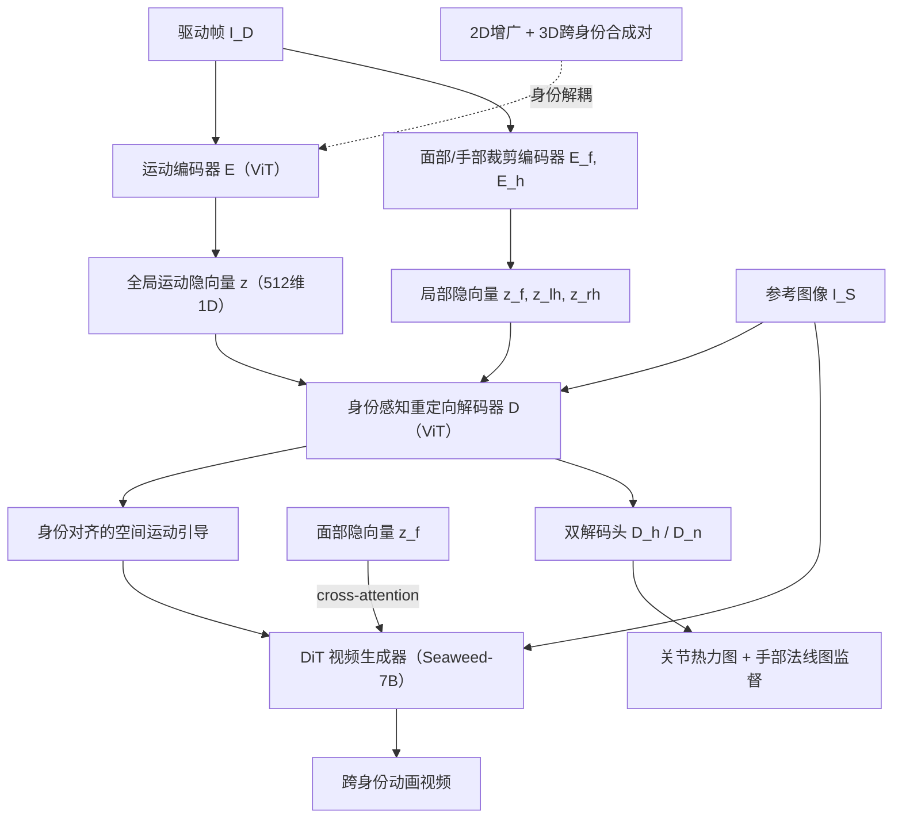

## 一句话总结

X-UniMotion 提出一种统一、富表现力且与身份无关的全身人体运动隐式表征，用四个解耦的隐向量（面部、身体、左右手各一）直接从单张图像编码运动，配合端到端联合训练的 DiT 视频生成模型，实现高保真的跨身份人体图像动画。

## 研究背景

给定一张参考人物图像和一段来自不同人物的驱动视频，把驱动者的全身运动（面部表情、身体姿态、手势）迁移到参考人物身上、生成时序连贯且保持身份的动画，是视频会议、虚拟形象、数字人等场景的核心任务。

现有运动迁移方法大多依赖显式提取的 2D/3D 姿态表征（如骨架关键点）。这类表征存在几个固有问题：

- 表现力有限，难以刻画细粒度动作（手指、微表情）和动态线索（如运动模糊）。
- 存在 2D 深度歧义，手指或肢体交叉、自遮挡时容易出错。
- 运动信号常与身份属性（体型、脸型）纠缠，跨身份迁移时需要启发式校正或手动标定，仍会出现身份漂移。

当参考人物与驱动人物在体型、脸型、姿态配置（正面/蹲姿）、空间覆盖（特写/全身）上差异显著时，这些局限被进一步放大。作者的核心洞见是：抛弃显式姿态输入，改为从单张图像隐式地编码与身份无关的运动。

## 方法

### 整体框架

方法遵循编码器-解码器范式并端到端联合训练：运动编码器从驱动帧提取隐式运动描述子，经身份感知的重定向解码器转成与参考主体结构对齐的空间运动特征，再作为条件驱动预训练的 DiT 视频生成器合成动画。训练以同一主体的帧重建自监督方式进行，并通过多种解耦手段使其在推理时泛化到跨身份迁移。

### 关键设计

1. **紧凑的 1D 全局运动隐向量 + 局部描述子**：编码器用 ViT 把驱动帧压成单个低维（512）的 1D 运动向量 $$z$$，遵循信息瓶颈原则充当低通瓶颈，只保留运动语义、丢弃高频视觉细节，并施加 KL 散度正则；同时省去 2D 空间布局以减少脸型、体型等身份信息泄漏。由于单一全局向量难以刻画手指与微表情，作者额外引入面部 $$z_f$$、左右手 $$z_{lh}, z_{rh}$$ 三个局部描述子，构成完整运动嵌入 $$z_{full}=(z, z_f, z_{lh}, z_{rh})$$，其中面部隐向量通过 cross-attention 注入 DiT 以更好地解耦面部身份。

2. **运动-身份解耦**：自监督训练中驱动帧与目标帧同属一人，易导致身份信息泄漏到 $$z$$。作者对驱动帧施加运动不变的增广（颜色抖动、$$30\%$$ 内随机缩放、分段仿射变换），迫使编码器只从驱动帧提取运动、让解码器与生成器依赖 $$I_S$$ 提供外观与结构。由于 2D 增广无法改变部位比例，进一步渲染同一姿态下的 3D 角色合成对，并对四肢、头、手做随机缩放，模拟异构跨身份迁移（如大头、大手的 3D 角色）。

3. **身份感知重定向解码器**：非对称 ViT 解码器 $$D$$ 以运动隐向量与参考图 $$I_S$$ 的线性投影 patch 拼接为输入，通过堆叠自注意力做深层空间推理与身份感知的运动适配，仅保留更新后的视觉 token 作为条件，使运动语义与参考结构对齐。

4. **监督式双解码引导**：仅靠扩散损失训练收敛慢、且 DiT 会用内部时序先验"幻想"运动而削弱对运动隐向量的依赖。作者在 $$D$$ 产出的空间运动特征上挂两个轻量卷积解码头 $$D_h, D_n$$，回归由 Sapiens 提取的逐关节热力图和手部法线图。手部法线图监督能有效化解 2D 骨架的深度排序与投影歧义，显著提升复杂手势与双手交互的处理能力；面部则沿用基于 GAN 的双渲染器监督。作者避免使用全身深度图监督，因其易编码衣物、发型等身份特征。

## 实验结果

训练数据约 200 小时真人视频加 3 小时合成数据（500 个 Mixamo 驱动的 3D 角色），在 80 张 A100 上训练 40K 步。评测基准为 100 张野外参考图 + 100 段野外驱动视频，分辨率 $$720 \times 1280$$，涵盖自重演与跨重演两种设定。下表为与 SOTA 视频重演基线的定量对比（跨重演的 FaceID-Sim 用 ArcFace 计算，FullID-Sim 与 Mot-Acc 来自 60 人用户研究；OmniHuman 应用了逐骨骼骨长对齐）。

| 方法 | SSIM ↑ | PSNR ↑ | LPIPS ↓ | FID ↓ | FVD ↓ | FaceID-Sim ↑ | FullID-Sim ↑ | Mot-Acc ↑ |
| --- | --- | --- | --- | --- | --- | --- | --- | --- |
| MimicMotion | 0.67 | 16.50 | 0.35 | 90.82 | 965.58 | 0.27 | 2% | 4% |
| Champ | 0.69 | 17.14 | 0.32 | 61.56 | 921.42 | 0.22 | 1.3% | 0% |
| AnimateAnyone | 0.70 | 18.81 | 0.29 | 58.20 | 592.61 | 0.42 | 2.3% | 1.3% |
| Animate-X | 0.79 | 22.18 | 0.23 | 48.78 | 380.37 | 0.56 | 15% | 3% |
| UniAnimate-DiT | 0.80 | 22.71 | 0.21 | 41.95 | 235.22 | 0.54 | 13.7% | 11.7% |
| OmniHuman* | 0.74 | 20.85 | 0.23 | 39.86 | 291.28 | 0.51 | 10% | 9.7% |
| X-UniMotion（本文） | **0.83** | **23.81** | **0.19** | **36.91** | **176.45** | **0.61** | **55.7%** | **70.3%** |

X-UniMotion 在所有指标上均优于基线，跨身份场景下的全身身份相似度与运动准确度用户偏好（55.7% / 70.3%）大幅领先。消融实验（以合成 3D 跨身份对上归一化关键点 L1 距离衡量）表明：去掉局部运动描述子、双解码、3D 合成对都会明显降低运动表现力，而用显式逐骨骼对齐替换本文的隐式运动表征效果最差，验证了隐式运动嵌入与重定向策略的必要性。此外，隐式运动描述子还支持视频外推（outpainting）——用运动扩散模型基于前 9 帧预测 81 帧未来运动码。

## 亮点与局限

亮点：

- 用仅四个解耦隐向量统一编码全身运动（表情、身体、双手），紧凑且与身份无关，天然规避 2D 骨架的深度歧义。
- 端到端联合训练运动编码器、身份感知解码器与 DiT 生成器，互相强化，推理时无需任何姿态估计或关键点预处理，对遮挡与极端光照更鲁棒。
- 双解码（关节热力图 + 手部法线图）监督加速收敛并注入深度感知，显著改善复杂手势与双手排序。
- 统一表征还可扩展到运动生成与视频外推等下游任务。

局限：

- 仅处理单人动画，尚未涉及多人场景与人-人、人-物交互。
- 面向人类或拟人角色设计，迁移到动物等异构主体仍是待解问题。
- 对高度困难的域外运动、以及皱眉等细微表情偶有失误，表现力受训练数据多样性制约。

## 延伸思考

- 隐式运动隐向量的最大价值在于它把"理解"与"生成"统一在同一空间，视频外推的成功提示这套表征或可作为运动语言模型的 token 基础，用于运动检索、编辑、补全等更广的运动理解任务。
- 用 3D 合成跨身份对来强制部位比例解耦是很实用的思路：2D 增广改不动部位比例，合成数据恰好补上这一维度，这对处理大头、大手等风格化角色尤其关键，也提示"真实数据管多样性、合成数据管解耦"的分工范式。
- 依赖 Sapiens 提供的热力图与法线图作为监督，说明纯扩散损失不足以逼出结构化运动信号；如何在无外部检测器的情况下进一步减少这类监督依赖，是走向更彻底"隐式"的下一步。
- 手部法线图相比深度图既提供了深度线索又避免了身份泄漏，这种"选择性几何监督"的取舍思路值得在其它需要几何约束又怕身份纠缠的任务中借鉴。
