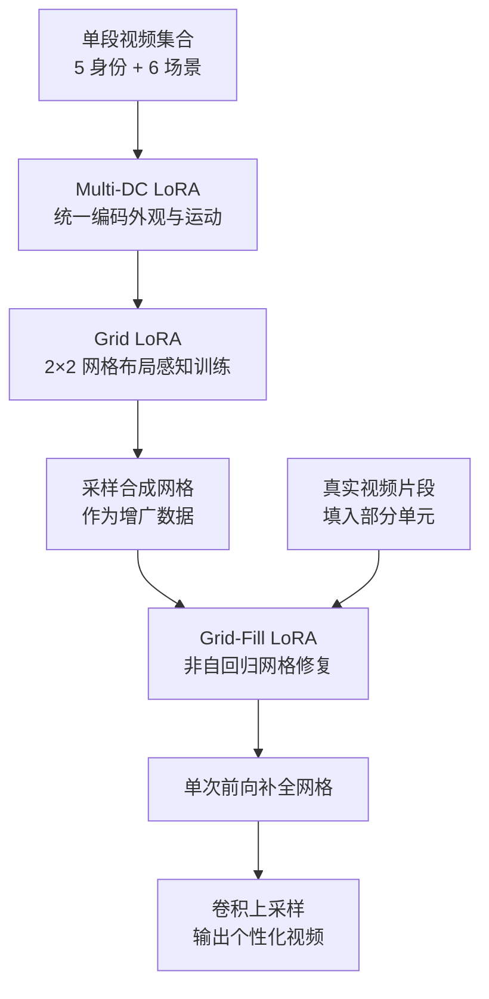

## 一句话总结

通过把动态概念的输入与输出组织成结构化的 2×2 视频网格，训练轻量级 Grid-LoRA 适配器，实现了无需逐视频微调、单次前向即可完成文本驱动编辑与多概念合成的零样本动态概念个性化框架。

## 研究背景

文本到视频生成已经能从文本与图像提示合成高分辨率、时序连贯的短片，但个性化视频生成仍然困难，尤其是需要对特定主体的外观和运动进行细粒度控制时。现有个性化方法大多依赖逐实例微调、运动重定向或测试时优化，这些方案计算昂贵、对未见输入脆弱，且从根本上难以扩展。

动态概念（Dynamic Concepts）是一个有前景的方向：用小型适配器（如 LoRA）从单段视频中同时捕捉外观与运动。但它仍需针对每个概念单独训练，速度慢、不可扩展，也不适合零样本个性化。本文的目标是构建一个完全前馈的框架，消除逐实例优化，并能零样本泛化到新主体与新合成组合。

## 方法

### 整体框架

方法在文本到视频扩散模型之上引入三个核心模块协同工作：Multi Dynamic Concept (DC) LoRA 统一编码多个概念的外观与运动；Grid LoRA 在结构化 2×2 网格上学习布局感知的合成与一致性；Grid-Fill LoRA 对部分可见的网格做条件修复。推理时先用真实或采样的概念填入一到两个网格单元，再由 Grid-Fill LoRA 单次前向补全整张网格，最后用轻量卷积上采样器恢复分辨率。

### 关键设计

- **Multi-DC LoRA 双低秩更新**：对基础权重 $$W \in \mathbb{R}^{m \times n}$$ 使用共享 $$A_1$$ 的两个低秩更新，$$\Delta W_{app} = A_1 B_1$$ 编码静态外观、$$\Delta W_{mot} = A_1 B_2$$ 编码运动，最终权重 $$W' = W + A_1 B_1 + A_1 B_2$$。所有动态概念被合并进单个 LoRA，用 [person_identity]、[action_motion] 等标识符在共同权重空间中区分，用流匹配损失训练，训练完成后冻结作为后续模块的基础生成器。

- **Grid LoRA 的结构化注意力掩码**：在合成模式下，网格顶行放两个不同概念（A 与 B），底行是二者融合。通过对查询 $$q_A$$、$$q_B$$、$$q_{Out}$$ 施加注意力掩码——$$q_A$$ 只关注 $$T_g \cup T_A$$，$$q_B$$ 只关注 $$T_g \cup T_B$$，$$q_{Out}$$ 关注全部——强制单元间空间独立，显著缓解概念泄漏（cross-pane leakage）。一致性模式下则令 $$\Delta W_{q,A} = \Delta W_{q,B}$$ 并去掉掩码，把同一概念克隆到各单元。

- **Grid-Fill LoRA 的非自回归修复**：训练时随机掩掉 2×2 网格中的一个或多个单元，在冻结的 Multi-DC LoRA 权重条件下用掩码区域的流匹配重建损失 $$L_{grid\text{-}fill} = \mathbb{E}_{x_t,t,M}\lVert v_\theta(x_t \odot M, t; T, W_{Multi\text{-}DC}) - \frac{\partial x_t}{\partial t} \odot M \rVert_2^2$$ 训练，单次前向即可补全，可将真实视频片段作为固定条件注入。

- **推理阶段减弱 Multi-DC LoRA**：作者发现 Multi-DC LoRA 虽提供初始归纳偏置，却常生成"平均化"的主体、丢失细粒度身份细节，因此推理时衰减甚至完全丢弃它、仅依赖 Grid-Fill LoRA，反而在复杂编辑下提升保真度。

## 实验结果

在人物中心视频编辑任务上与多种基线对比（评估身份保持 ID、CLIP-Text 语义对齐 C-T、时序一致性 TC），本文方法在可编辑性与身份保持之间取得了更好的权衡：

| Method | ID ↑ | C-T ↑ | TC ↑ |
| --- | --- | --- | --- |
| DreamVideo | 0.4477 | 0.2133 | 0.9868 |
| NewMove | 0.5280 | 0.1943 | 0.9960 |
| DreamMix | 0.5542 | 0.1904 | 0.9983 |
| DB-LoRA | 0.5967 | 0.1906 | 0.9981 |
| Ours | 0.5750 | 0.2194 | 0.9965 |

DB-LoRA 因逐实例过拟合获得最高 ID，但 C-T 偏低说明缺乏真正的可编辑性；本文方法在保持较高 ID 的同时取得最高的语义对齐分数。10 人用户研究中，本文在整体偏好上对逐概念微调方法（DreamMix、DB-LoRA）超过 70%，对 UNet 类方法（NewMove、DreamVideo）接近 100%。

## 亮点与局限

亮点：把"网格布局 + 上下文学习"引入动态概念个性化，用三阶段 LoRA 把外观、运动、布局与修复解耦，实现完全前馈、单次前向的零样本编辑与合成；结构化注意力掩码有效抑制概念泄漏；即便 Grid-Fill LoRA 仅用约 25 个（主要为人物）样本训练，也能泛化到猫、水等域外场景，并可扩展到故事生成。

局限：为平衡显存与速度，LoRA 推理在半分辨率进行再上采样；单次前向无逐实例微调，身份保持上限受限于逐视频 LoRA 方法；重建与编辑质量根本上受基础视频扩散模型能力约束，对翻转、鞭甩等异常剧烈运动可能出现可见伪影。

## 延伸思考

网格化"输入-输出对"的思路本质上是把视觉上下文学习（visual in-context learning）从图像域搬到了视频域，用空间排布替代了显式的条件网络设计，这为其他视频任务（如可控运动迁移、多主体交互）提供了一种统一而轻量的范式。一个值得追问的问题是：2×2 布局把有效分辨率和注意力预算摊薄到四个单元，当需要更多概念或更长序列时，网格如何扩展而不牺牲单元质量？作者提到 1×3 等替代布局，但布局设计、token 预算与生成质量之间的权衡仍是可深入探索的方向。此外，推理时"减弱基础 LoRA 反而更好"这一反直觉现象，暗示统一编码多概念的适配器存在身份平均化问题，如何在共享参数与个体保真之间取得更优平衡也值得进一步研究。
